# GDD - Game Design Document - Módulo 1 - Inteli


## Hackeados

#### Integrantes do Grupo
Alexsander da Silva Barbosa

Bruno Frossard Silva

Isabela Szolnoky Ferreira Cabral Souza da Conceição

Leonardo Nicoli Lameda

Maria Eduarda Barbosa Oliveira

Matheus Ferreira da Silva

Stefanne Victória Andrade Soares


## Sumário

[1. Introdução](#c1)

[2. Visão Geral do Jogo](#c2)

[3. Game Design](#c3)

[4. Desenvolvimento do jogo](#c4)

[5. Casos de Teste](#c5)

[6. Conclusões e trabalhos futuros](#c6)

[7. Referências](#c7)

[Anexos](#c8)

<br>


# <a name="c1"></a>1. Introdução (sprints 1 a 4)
Na seção 1, apresentaremos a concepção, idealização e desenvolvimento do jogo, juntamente a um detalhamento sobre diversos tópicos, dentre eles: valores, missão, contexto de indústria e especificidades do nosso parceiro de projeto e o mercado no qual ele se encontra inserido.
Nesse sentido, o jogo “Hackerados” é o resultado de um projeto do primeiro módulo da faculdade Inteli (Instituto de Tecnologia e Liderança). Fomos desafiados a desenvolver um jogo, em parceria com o Google for Education — reconhecida por ser um conjunto de ferramentas que auxilia escolas, universidades e alunos com sua rotina acadêmica — que abordasse um tema de suma importância e complexidade: a Lei Geral de Proteção de Dados (LGPD). Perante a incitação, percebemos, através de pesquisas, a falta de conhecimento dos alunos sobre o assunto. Assim, decidimos criar uma imersão divertida e educativa, que conta a história de um aluno que está sendo hackeado, e mediante a isso, ele deverá “correr contra o tempo” para resolver problemas e completar fases com dinâmicas relacionadas à legislação em questão. Por fim, haverá um embate final com o Hacker, que definirá a recuperação ou não dos dados que outrora foram roubados. É uma aventura inusitada e que gerará conhecimento com respaldo legislativo.


## 1.1. Plano Estratégico do Projeto
O plano estratégico (1.1), é o guia do nosso grupo, pautado em metas e ações que visam contribuir para o nosso produto final, sua interface e integração com nosso parceiro, o Google for Education, considerando sua cultura, valores e missão. À luz disso, optamos por utilizar a gamificação, estudos de caso e análise de situações reais como metodologias para garantir um aprendizado acessível e eficaz e, a partir disso, criar um jogo de aventura, que conta com um cenário envolvente, no qual o aluno percorrerá uma jornada do herói, marcada pela resolução de um conflito, sendo o protagonista do enredo. Desse modo, ao percorrer um mundo fictício, alternado a temas reais, o aluno deverá adquirir conhecimento sobre a LGPD de maneira leve, à medida que a história se desenvolve. Entendemos que, para gerar uma atmosfera de urgência de resolução, junto da ideia de gerar certa adrenalina, seria necessário adicionar um timer, o qual remete ao tempo restante para que as informações sejam devidamente recuperadas. Outrossim, vale ressaltar que o tempo decorrido do timer será utilizado posteriormente para classificação, quando o feedback do jogo aparecer ao fim da trama. Dessarte, é iminente a estratégia de abranger a pessoa ao cenário do game, objetivando a retenção de aprendizagem, com táticas de fluidez e diversão. Trabalhar a lei em questão, para os alunos, é extremamente desafiador, e captar sua atenção é essencial para o sucesso da implementação do game.


### 1.1.1. Contexto da indústria (sprint 2)

Esta seção (1.1.1) será responsável por apresentar o contexto da indústria do Google for Education,abordando os principais players, modelos de negócios e tendências. 

A empresa compete com grandes players como Microsoft Education e Apple Education, cada um com suas ferramentas e plataformas para facilitar o aprendizado digital. O modelo de negócio do Google for Education combina produtos gratuitos, como o Google Classroom e Google Meet, com opções pagas que oferecem recursos adicionais, como maior capacidade de armazenamento. Entre as principais tendências do mercado, destacam-se a crescente adoção de inteligência artificial para personalizar o aprendizado, a expansão da educação a distância e a gamificação, que tornam o processo educacional mais interativo e envolvente. A atuação do Google for Education é global, com presença significativa em regiões como América Latina, Europa, Ásia e Estados Unidos, com foco na democratização do acesso à educação e à tecnologia, embora restrito em países com regimes tecnológicos fechados, como a Coreia do Norte.


#### 1.1.1.1. Modelo de 5 Forças de Porter (sprint 2)

Esta seção (1.1.1.1)  realizará uma análise setorial do Google for Education com base nas 5 Forças de Porter (1979), que consiste em apontar tópicos que localizem a empresa no mercado atual,  com o objetivo de sustentar o contexto da indústria descrita na seção anterior e sua permanência em seu segmento.


**Força 1: rivalidade entre concorrentes**

O Google for Education oferece uma gama de ferramentas educacionais baseadas na nuvem, como Google Classroom, Google Docs e Google Meet. Apesar do seu amplo market share, alguns concorrentes se destacam pelas semelhantes ferramentas que oferecem. 
O principal concorrente é a Microsoft Teams for Education (Microsoft), já que diversas ferramentas oferecidas por eles poderiam substituir as oferecidas pela Google for Education, como a Microsoft Teams (alternativa ao Google Classroom), OneDrive (alternativa do Google Drive), Microsoft Word (alternativa do Google Docs), entre outros. Diante disso, é possível inferir que a Microsoft representa um risco médio para a Google for Education, uma vez que oferece ferramentas semelhantes e oferece planos gratuitos para instituições educacionais. Entretanto, quanto a usabilidade, a interface do Google tende a ser mais intuitiva. 
Outro grande concorrente é a Apple School Manager (Apple), que também oferece um ecossistema educacional, principalmente voltado para dispositivos iOS e macOS, como 
A Apple também oferece um ecossistema educacional, principalmente voltado para dispositivos iOS e macOS, como Apple School Manager (alternativa ao Google Workspace for Education), iCloud (substituto do Google Drive) e Classroom App (compete com o Google Classroom). É possível inferir que a Apple School Manager oferece um baixo risco de substituição. Apesar de oferecer produtos poderosos, a Apple enfrenta uma barreira de custo, além da exclusividade de funcionamento em dispositivos da Apple.
Outro player é o Moodle (Open-source LMS), um dos principais sistemas de gestão de aprendizado utilizados por escolas e universidades, possuindo uma plataforma personalizável que permite que instituições criem seu próprio ambiente de ensino online. Assim, o Moodle apresenta risco médio de substituição, visto que, apesar de ser gratuito e altamente customizável, ele demanda mais esforço técnico e não oferece tantos recursos como o Google for Education.

Considerando a análise sobre os concorrentes do Google for Education, conclui-se que o mercado de tecnologia educacional é relativamente concentrado, com poucos grandes players dominando o mercado. O Google for Education possui uma participação expressiva, especialmente entre escolas e universidades que utilizam seus serviços em conjunto com Chromebooks. Seus principais concorrentes diretos são a Microsoft, com o Teams for Education, e a Apple, que ocupa um espaço menor, uma vez que é focada em escolas particulares e instituições que utilizam iPads. Por haver poucos players dominantes, a competição acontece principalmente pela diferenciação e estratégias de fidelização, como a integração com dispositivos e a oferta de recursos exclusivos.
Por outro lado, se considerarmos substitutos indiretos, como plataformas de cursos online (Udemy, Coursera, Khan Academy), sistemas LMS independentes (Moodle, Canvas, Blackboard) e até ferramentas de comunicação (Discord, WhatsApp, Zoom), o mercado se torna mais diluído, já que há diversas opções que atendem a necessidades específicas de aprendizado e colaboração.
Portanto, o mercado de tecnologia educacional não é extremamente diluído,  mas também não é dominado por um único player. A concorrência direta representa uma ameaça moderada, uma vez que, embora existam alternativas efetivas, o Google for Education se destaca pela forte integração entre suas ferramentas, o que reforça sua posição competitiva.


**Força 2: poder de barganha dos fornecedores**

O Google for Education controla sua própria infraestrutura de nuvem por meio do Google Cloud Platform (GCP), o que é um diferencial. Isso significa que, ao contrário de concorrentes como a Microsoft, que usa o Azure, e o Moodle, que necessita de hospedagem externa, o Google não depende de terceiros para manter seus servidores e serviços funcionando. Essa independência reduz a influência de fornecedores nesse aspecto. 
Entretanto, isso muda na questão do hardware. O Google não fabrica os Chromebooks diretamente, dependendo de empresas como Acer, HP, Lenovo e Dell para produzir tais dispositivos, que são amplamente usados por escolas. Devido a quantidade de fabricantes no mercado, o poder de barganha de um único fornecedor diminui. No entanto, problemas na cadeia global de suprimentos, como a escassez de chips que aconteceu durante a pandemia, e que dificultou a produção de Chromebooks, tornando-os menos acessíveis para escolas, podem impactar preços e prazos de entrega, o que pode se tornar um obstáculo caso os fabricantes decidam priorizar notebooks com Windows em vez de Chromebooks.
Outro ponto é a parceria com provedores de conteúdo educacional, como Khan Academy, por exemplo. Apesar do Google for Education possuir suas próprias ferramentas, como o Google Classroom, ele ainda precisa de materiais de terceiros para complementar sua oferta. Caso esses fornecedores decidam aumentar preços ou fechar exclusividade com concorrentes, como o caso da colaboração entre Byju’s e Disney, por exemplo, o Google pode perder parte da atratividade. Por outro lado, muitas escolas ainda utilizam materiais didáticos convencionais, o que reduz essa dependência.
Portanto, diante do exposto, é possível concluir que o poder de barganha dos fornecedores é de moderada a baixa. 


**Força 3: poder de barganha dos compradores**

O poder de barganha dos compradores no Google for Education pode ser considerado baixo a médio, já que a empresa atende milhões de alunos, professores e instituições de ensino ao redor do mundo. Como os clientes estão amplamente distribuídos, nenhum comprador individual tem poder suficiente para pressionar significativamente a empresa a reduzir preços ou modificar o produto. Além disso, muitos dos serviços oferecidos, como Google Classroom e as ferramentas do Google Workspace, são gratuitos, o que reduz ainda mais a possibilidade de negociação por parte dos usuários.
Para as instituições que optam pelas versões pagas do Google Workspace for Education ou pela compra de Chromebooks gerenciados, há alguma margem para negociação, principalmente em contratos de grande porte. No entanto, como o Google já pratica preços competitivos e oferece um conjunto de soluções integradas, dificilmente os clientes conseguem exercer grande pressão para conseguir descontos expressivos.
Outro fator que reduz o poder de barganha dos compradores é o custo de mudança para outra plataforma. Quando uma escola ou universidade adota o Google for Education, trocar de plataforma pode ser um processo complicado. A transição para alternativas como Microsoft Teams for Education ou Moodle exige tempo e recursos, já que envolve a migração de dados, treinamento de professores e a adaptação a novas ferramentas


**Força 4: ameaça de novos entrantes**

A ameaça de novos entrantes no mercado de tecnologia educacional, especialmente no segmento do Google for Education, existe, apesar de não representar um risco tão alto no curto prazo por conta de barreiras que dificultam uma competição direta. 
O primeiro grande obstáculo é a escala e o reconhecimento de marca. O Google já tem uma base enorme de usuários em escolas e universidades ao redor do mundo. Além disso, sua infraestrutura com o Google Cloud garante que os serviços sejam estáveis e bem integrados com outras ferramentas amplamente usadas, como Gmail, Drive e Meet. Para um novo concorrente, alcançar essa mesma abrangência e credibilidade levaria tempo e exigiria um grande investimento. A necessidade de capital também é uma barreira relevante, uma vez que criar e manter uma plataforma educacional de grande porte exige investimentos altos em tecnologia, segurança e suporte técnico. Grandes empresas como Google, Microsoft e Apple dominam esse setor e possuem recursos financeiros para continuar inovando, o que torna difícil para startups competirem diretamente com eles. Além disso, o acesso aos canais de distribuição é um fator que protege o Google, visto que a empresa tem parcerias sólidas com governos, escolas e fabricantes de hardware. 
Embora novas EdTechs estejam surgindo com propostas inovadoras, o impacto sobre o setor como um todo é mais de diversificação do que de substituição. Startups tendem a focar em nichos específicos, como gamificação e ensino personalizado, como é o caso do Byju’s e Kahoot!, por exemplo, enquanto o Google for Education continua dominante em soluções para escolas e universidades. No longo prazo, se essas empresas crescerem e oferecerem alternativas mais completas, podem ser uma pressão a inovar ou ajustar seus modelos de negócio.


**Força 5: ameaça de produtos ou serviços substitutos**

Após uma análise do mercado global, percebe-se que o Google Education oferece aplicativos como Google Classroom e Google Agenda, mas ainda fica atrás em relação às tendências atuais do setor educacional. De acordo com a plataforma Educate-Me, o Google Classroom apresenta algumas limitações significativas. Sua acessibilidade em dispositivos móveis não é tão intuitiva quanto outras soluções disponíveis no mercado, além de possuir baixas opções de customização quando comparado a outros LMSs. Além disso, a plataforma enfrenta restrições na integração com outras ferramentas e não conta com Inteligência Artificial (IA) para automação e personalização do ensino, tornando-se menos competitiva.
Por outro lado, o mercado global de IA na educação está em plena ascensão. Segundo um estudo realizado pela Business solution, em 2022, esse mercado foi avaliado em aproximadamente US$ 2,48 bilhões. As projeções indicam um crescimento exponencial, estimando que esse valor atinja US$ 53,68 bilhões até 2032, com uma taxa composta de crescimento anual (CAGR) de 36,0% durante esse período.
Diante desse cenário, para que uma nova solução educacional se destaque, é essencial que ela apresente uma experiência mobile aprimorada, garantindo acessibilidade intuitiva em qualquer dispositivo, além de oferecer mais opções de customização, permitindo maior personalização para professores e alunos. Também é fundamental que a plataforma tenha maior integração com outras ferramentas, reduzindo limitações e facilitando conexões com diferentes tecnologias. Além disso, deve contar com automação em tempo real, incluindo um chat interativo para comunicação instantânea entre alunos e professores, bem como Inteligência Artificial para otimização de feedbacks, automatizando avaliações e proporcionando um ensino mais eficiente. Outra característica essencial é a capacidade de criar sessões em tempo real, permitindo interatividade e dinamismo no aprendizado. Com essas melhorias, um novo aplicativo educacional pode se destacar no mercado e atender às demandas de um setor cada vez mais tecnológico e impulsionado pela Inteligência Artificial.
Ademais, o Google Agenda se limita em alguns aspectos. Em primeiro plano, a necessidade de adicionar cada evento manualmente e ajustar os horários caso surjam conflitos pode ser facilmente substituído pela automatização das inteligências artificiais. Ainda, o Google Agenda não mostra estatísticas de produtividade e controle de tempo. É nesse momento em que a Reclaim.AI surge como uma ameaça: ele organiza suas reuniões, tarefas e tempo de foco automaticamente, ajustando-se conforme sua disponibilidade, e não só isso mas também é possível obter estatísticas de produtividade para ajudar você a entender quanto tempo você gasta em reuniões, rotinas e controle avançado de tempo para tarefas. Isso é importante visto que cada usuário possui uma prioridade diferente, e dessa forma, com a análise das estatísticas, é possível visualizar quais das atividades estão tomando mais tempo do indivíduo. Portanto, é visível que, para o Google Education, nesses aspectos citados a Inteligência Artificial aparece com uma ameaça com base na automatização das atividades.


### 1.1.2. Análise SWOT (sprint 2)

Esta seção (1.1.2) apresenta a Análise SWOT do parceiro de projeto. A análise SWOT é uma ferramenta de planejamento estratégico que auxilia o administrador na visão de sua empresa, seja no âmbito interno ou externo, praticando de forma objetiva e simplificada pontos de ajuste e possíveis tendências de um negócio. Ela examina quatro aspectos principais: forças (vantagens e diferenciais internos), fraquezas (pontos de melhoria ou limitações internas), oportunidades (fatores externos favoráveis ao crescimento) e ameaças (riscos e desafios externos).

Olhando para o contexto do parceiro Google for Education foi identificado os seguintes pontos:

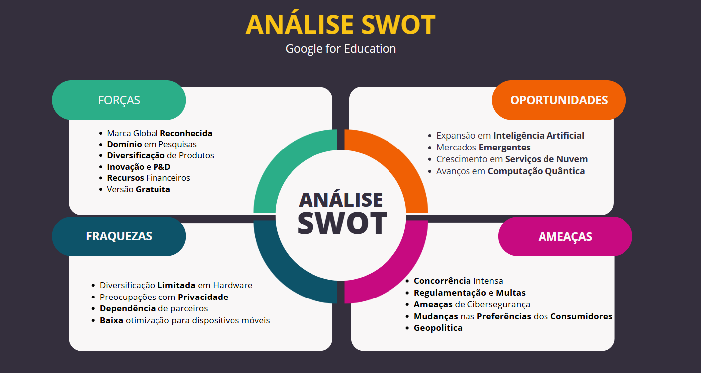
Disponível em: https://www.canva.com/design/DAGgOu_mc9c/Dj1MtKW2KtskahvFVMGX8Q/view?utm_content=DAGgOu_mc9c&utm_campaign=share_your_design&utm_medium=link2&utm_source=shareyourdesignpanel 

### 1.1.3. Missão / Visão / Valores (sprint 2)

Esta seção (1.1.3) apresenta a Missão, Visão e Valores da Google for Education, destacando seus propósitos fundamentais.

**Missão:** Ajudar mais pessoas, especialmente aquelas em comunidades com poucos recursos, a se beneficiarem da promessa da tecnologia, tanto dentro quanto fora das salas de aula.

**Visão:** Garantir acessibilidade a todos os estudantes do mundo por meio da tecnologia.

**Valores:** Compromisso, Responsabilidade, Ética, Acessibilidade, Inovação e Educação Criativa.


### 1.1.4. Proposta de Valor (sprint 4)

*Posicione aqui o canvas de proposta de valor. Descreva os aspectos essenciais para a criação de valor da ideia do produto com o objetivo de ajudar a entender melhor a realidade do cliente e entregar uma solução que está alinhado com o que ele espera.*

### 1.1.5. Descrição da Solução Desenvolvida (sprint 4)

*Descreva brevemente a solução desenvolvida para o parceiro de negócios. Descreva os aspectos essenciais para a criação de valor da ideia do produto com o objetivo de ajudar a entender melhor a realidade do cliente e entregar uma solução que está alinhado com o que ele espera. Observe a seção 2 e verifique que ali é possível trazer mais detalhes, portanto seja objetivo aqui. Atualize esta descrição até a entrega final, conforme desenvolvimento.*

### 1.1.6. Matriz de Riscos (sprint 4)

*Registre na matriz os riscos identificados no projeto, visando avaliar situações que possam representar ameaças e oportunidades, bem como os impactos relevantes sobre o projeto. Apresente os riscos, ressaltando, para cada um, impactos e probabilidades com plano de ação e respostas.*

### 1.1.7. Objetivos, Metas e Indicadores (sprint 4)

*Definição de metas SMART (específicas, mensuráveis, alcançáveis, relevantes e temporais) para seu projeto, com indicadores claros para mensuração*


## 1.2. Requisitos do Projeto (sprints 1 e 2)

Esta seção (1.2) apresenta os requisitos do projeto, que incluem tanto demandas do parceiro quanto soluções propostas pela equipe.


| Número | Requisito               | Descrição | Objetivo |
|--------|-------------------------|-----------|----------|
| 1      | Desenvolver a Tela de Abertura        | O jogo começará com um termo de consentimento, e um botão grande de "JOGAR" para iniciar a experiência. | Introduzir o jogador à temática da proteção de dados desde o início, criando uma conexão com o tema principal do jogo. |
| 2      | Criar os personagens  | O jogador poderá escolher entre diferentes personagens. | Personalizar a experiência do jogador, permitindo que ele se identifique com o avatar escolhido e aumentando a imersão no jogo. | 
| 3      | Elaborar o Feedback Educacional    | Após cada tarefa, o jogo exibirá um feedback educativo, citando os artigos da LGPD relacionados. | Associar as atividades do jogo com a legislação real, garantindo que o jogador compreenda a base legal das proteções de dados. | 
| 4      | Definir um Timer                   | O jogador terá um tempo limite de 10 minutos para resolver todas as tarefas antes que seus dados sejam vazados. | Criar um senso de urgência e desafio, incentivando o jogador a agir rapidamente para proteger seus dados. | 
| 5      | Fazer o Sistema de Classificação | O jogador receberá uma medalha (ouro, prata ou bronze) dependendo do tempo gasto para concluir o jogo. | Estimular a repetição do jogo para melhor desempenho, incentivando a aprendizagem gamificada. | 
| 6      | Criar o Livro de Curiosidades    | Um livrinho abaixo do timer será atualizado a cada fase com curiosidades sobre a LGPD. | Fornecer aprendizado progressivo, incentivando o jogador a descobrir novas informações ao longo do jogo. | 
| 7      | Escrever a Mensagem Final          | Após vencer o jogo, o jogador verá uma mensagem educativa sobre segurança digital, incluindo um passo a passo de como reagir em caso de vazamento de dados. | Reforçar o aprendizado e fornecer orientações reais para que o jogador saiba como se proteger na vida real. |
| 8      | Desenvolver um Mapa                    | Um mapa no canto da tela mostrará as tasks pendentes, destacadas com um ícone de exclamação. | Ajudar o jogador a se orientar dentro do ambiente e a entender quais missões ainda precisam ser concluídas. | 
| 9      | Programar o controle do personagem   | O jogador poderá movimentar seu personagem utilizando as teclas de seta. | Tornar a experiência mais interativa e dinâmica, permitindo a livre exploração do ambiente e imersão no jogo. | 


## 1.3. Público-alvo do Projeto (sprint 2)

Esta seção (1.3) apresenta a definição do público-alvo do projeto, com base em critérios demográficos e comportamentais.

O público-alvo do projeto norteará a interface do jogo, suas missões e sua linguagem, garantindo uma jogabilidade fluida e com nível de dificuldade adequado. Por isso, o jogo foi criado pensando em uma audiência bem definida: crianças, adolescentes e professores, especificamente de escola pública. Nesse sentido, foi escolhida a faixa etária de 9 a 17 anos para o público infanto-juvenil. O desenvolvimento do projeto foca em atividades que mantenham a atenção e o foco do jogador, evitando distrações e garantindo uma experiência coesa e acessível. Para isso, a linguagem utilizada é simples e direta, sem exigir conhecimentos prévios para que os usuários possam acessar e executar as tarefas ao longo da jornada do personagem.

A partir desse contexto, visando alinhar a proposta do jogo com o público-alvo, foram realizadas pesquisas que contribuem para o entendimento das necessidades dos principais usuários para, assim, adaptar as mecânicas e abordagem de conteúdos no jogo. Dessa forma, os principais tópicos abordados foram: 
- **Ingresso precoce de crianças na internet:** A idade do primeiro acesso à Internet por crianças brasileiras vem se antecipando nos últimos anos. A TIC Kids Online Brasil 2023, mostrou que 24% dos entrevistados relataram ter começado a se conectar à rede na primeira infância, ou seja, até os seis anos de vida. A título de comparação, na edição de 2015, essa proporção era de 11%.
- **Qualidade da internet no país:** Dados mostram que, no Brasil, apenas 20% da internet é de boa qualidade em detrimento de outros países como os Estados Unidos que esta porcentagem chega a ser 94% para a população.
- **Recusa de adoção de práticas envolvendo LGPD em empresas:** Levantamento realizado pelo Grupo Daryus, consultoria especializada no tema, indica que 80% das empresas no Brasil ainda não estão completamente adequadas à LGPD; 35% dizem estar parcialmente adequadas e 24% em fase inicial de adequação.
- **Desconhecimento sobre a legislação:** Segundo pesquisa do O Globo, apenas quatro em cada dez brasileiros (44%) conhecem a Lei Geral de Proteção de Dados (LGPD), que dita as regras para coleta, armazenamento e tratamento de dados pessoais e busca proteger as informações do cidadão. Além disso, de acordo com a pesquisa TIC Kids Online Brasil 2022, 58% dos jovens de 9 a 17 anos já ouviram falar da Lei Geral de Proteção de Dados (LGPD), mas apenas 33% sabem que a lei protege seus dados pessoais. Isso sugere que, apesar de a LGPD estar em vigor desde 2018, ainda há um longo caminho a percorrer em termos de conscientização entre os jovens. A pesquisa também revela que somente 20% dos jovens leram os termos de uso e políticas de privacidade de redes sociais e aplicativos, o que é preocupante, visto que a maioria deles utiliza essas plataformas regularmente.


# <a name="c2"></a>2. Visão Geral do Jogo (sprint 2)
Nesta seção (2) e nos subtópicos subsequentes, iremos discorrer sobre o jogo e seus detalhes, desde o objetivo de sua criação, características e detalhes de jogabilidade, até inspirações, mundo de jogo, concept art e outros detalhes dentro do ecossistema existente para ideação, prototipação e entrega final do jogo Hackerados.


## 2.1. Objetivos do Jogo (sprint 2)

Esta seção (2.1) apresenta a descrição dos objetivos a serem alcançados ao longo do jogo, bem como o desenvolvimento preliminar de mecânicas relacionadas às demandas estabelecidas para o grupo.

Para concluir o jogo, o player deve superar desafios que testam seus conhecimentos sobre a LGPD, abrangendo desde conceitos básicos dessa legislação até um entendimento mais aprofundado sobre o tema. Essas aplicações serão exploradas por meio da implementação de mini games em três cenários distintos, que devem ser concluídos de maneira assertiva e eficiente, demonstrando um real entendimento das problemáticas apresentadas em cada tarefa.
Além disso, haverá um livro que conterá fragmentos da legislação oficial, proporcionando um maior nível de familiaridade com o documento. Dessa forma, o principal objetivo do jogo é garantir uma compreensão integral e clara das problemáticas associadas ao descumprimento da Lei Geral de Proteção de Dados, conscientizando o público-alvo sobre os malefícios que tais infrações podem causar em suas vidas.
Apesar da atmosfera narrativa e fictícia, o jogo busca fornecer informações concretas sobre como agir em situações reais. Por esse motivo, ao final da experiência, será disponibilizada uma cartilha contendo orientações sobre os passos a serem seguidos em casos de violação de dados na internet. Essa cartilha conecta-se à temática central do jogo — ser hackeado — e tem como objetivo preparar minimamente os jogadores para reagirem a situações adversas no futuro, com base no conhecimento adquirido ao longo do jogo e nas instruções fornecidas.


## 2.2. Características do Jogo (sprint 2)

### 2.2.1. Gênero do Jogo (sprint 2)

Esta seção (2.2.1) define o gênero do jogo, categorizando-o dentro das principais classificações do mercado.

O jogo tem como proposta ser um RPG de ação, no qual o jogador assume o papel de um personagem que explora um mundo interativo, enfrentará desafios e toma decisões estratégicas para aprender sobre a Lei Geral de Proteção de Dados (LGPD). A narrativa combina elementos de aprendizado, resolução de problemas e conquistas, o que incentiva o jogador a aprender enquanto se diverte. Além das interações dinâmicas, o jogo contará com missões que simulam desafios do mundo real, onde será necessário se colocar em situações hipotéticas, mas que podem ocorrer com ele na vida real.

### 2.2.2. Plataforma do Jogo (sprint 2)

Esta seção (2.2.2) define a plataforma na qual o jogo será disponibilizado, abrangendo tanto o tipo de dispositivo quanto os sistemas compatíveis, como os navegadores específicos.

Quanto ao dispositivo, o jogo estará disponível para desktop, e conseguirá ser executado com eficiência na maioria dos navegadores como: Google Chrome, Firefox, Opera e Safari.

### 2.2.3. Número de jogadores (sprint 2)

Esta seção (2.2.3) define o número de jogadores suportados pelo jogo, especificando se a experiência será voltada para um único jogador, modo cooperativo, competitivo ou multiplayer.

O jogo se baseia na modalidade single player, permitindo que o jogador escolha seu personagem. A aventura é constituída de um enredo marcado pela jornada do herói: o jogador inicia o jogo sendo hackeado, e deverá, dessa maneira, contrariar as expectativas e combater o hacker no tempo estimado, evitando que seus dados sejam efetivamente vazados e utilizados. Para isso, será necessário que a pessoa, no comando do personagem, movimente-se pelo mapa, de maneira simples, utilizando teclas e os comandos necessários para realização de tarefas, pois a ideia é que não seja necessário nenhum conhecimento específico para ter acesso ao jogo.


### 2.2.4. Títulos semelhantes e inspirações (sprint 2)

Esta seção (2.2.4) apresenta uma análise de títulos semelhantes e jogos que serviram de inspiração para o projeto.

O projeto foi inspirado em três jogos principais: *Grand Theft Auto V*, *Pokémon FireRed* e *The Escapists*. Nesse sentido, cada um contribuiu para um aspecto específico do desenvolvimento: o sistema de conquistas foi baseado em *Pokémon FireRed*, a exploração do ambiente e a sensação de imersão em mundo aberto inspiradas em *GTA V*, e a mecânica, resolução de tarefas e coleta de itens segue a abordagem do *The Scapists*. Cada detalhe foi implementado para que pudesse haver uma imersão fluida ao enredo do jogo, tornando-o interessante e interativo.


### 2.2.5. Tempo estimado de jogo (sprint 5)

*Ex. O jogo pode ser concluído em 3 horas passando por todas as fases.*

*Ex. cada partida dura até 15 minutos*

# <a name="c3"></a>3. Game Design (sprints 2 e 3)
A seção de Game Design (3) apontará os detalhes vinculados à experiência do usuário e ao jogo, contemplando seu enredo e os detalhes atrelados a ele, que impactam, de alguma forma e de maneira direta, o consumidor. Portanto, será uma parte descritiva de cada particularidade do jogo, como as características do mapa, dos personagens existentes, da atmosfera criada, sons, e outros detalhes pertinentes.

## 3.1. Enredo do Jogo (sprints 2 e 3)

Nesta seção (3.1) será apresentado o enredo do jogo Hackerados.

A priori, a história do jogo se baseia no método narrativo da jornada do herói, constituído por um conceito envolvendo um protagonista que parte em uma missão para resolver um momento de crise e que retorna vitorioso, com mudanças significativas em sua vida e em seu desenvolvimento pessoal. Tendo isso em vista, foi desenvolvido o arco narrativo de um estudante comum que, após ter aceitado os termos de uso sem a devida leitura, passa a ser atacado por um hacker. Para evitar que seus dados sejam vazados, ele deverá solucionar tal problemática o mais rápido possível. Entretanto, a situação não é tão simples, uma vez que não apenas seus dados estão sendo roubados, como também os de seus colegas, que seguiram seus passos sem dar a devida atenção aos termos de consentimento desmedidos e abusivos. A partir disso, o jogador possui  um tempo máximo de 10 minutos para completar missões nos diversos cenários escolares destruídos e pós-apocalípticos, garantindo que suas informações não sejam distribuídas de forma indevida. As missões devem ser concluídas em ambientes como salas de aula, laboratório de informática, biblioteca e porão. Cada local apresentará um novo desafio ao usuário, testando seus conhecimentos sobre diversos tópicos da LGPD. Ao final,  ele enfrentará o hacker em um embate decisivo para restaurar a normalidade do mundo e retomar sua vida comum, porém, mais cauteloso com questões envolvendo sua privacidade e segurança.


## 3.2. Personagens (sprints 2 e 3)

### 3.2.1. Controláveis

Nesta seção (3.2.1), serão abordados os personagens que o jogador poderá utilizar na sua jornada. Nesse sentido, é importante entender as características de cada personagem, como a vestimenta, personalidade e aparência.


| Personagem  | Imagem | Idade | Aparência | Roupa | Personalidade |
|-------------|--------|-------|-----------|--------|--------------|
| **Ju** | 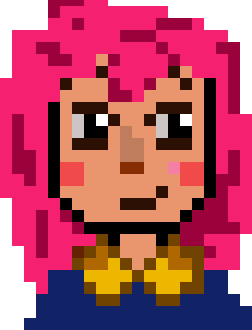 | 13 anos | Cabelo médio e liso (castanho ou rosa), olhos castanhos escuros, pele clara | Uniforme escolar azul com gravata amarela, calça azul-escura e tênis branco | Inteligente e curiosa, sempre quer entender mais sobre segurança digital |
| **Chiquinho** |  | 15 anos | Cabelo preto, curto e bagunçado, olhos castanhos, pele clara | Uniforme azul com gravata amarela, calça azul-escura e tênis branco | Usa uma cadeira de rodas moderna e funcional, é determinado e busca entender mais sobre proteção de dados |
| **Ricardo** | 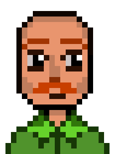 | 35 anos | Careca, barba rala, olhos castanhos, pele clara | Camisa social, calça jeans, óculos e sapatos pretos | Professor de matemática há mais de 10 anos, tem grande conhecimento sobre números e a vida |
| **Camila** | 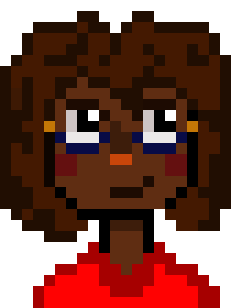 | 45 anos | Cabelos castanhos, crespos e volumosos, olhos castanhos, pele negra | Vestido social e sapatos pretos | Professora de artes em 3 escolas públicas, ensina como a arte pode mudar perspectivas |


### 3.2.2. Non-Playable Characters (NPC)

Esta seção (3.2.2) apresenta os personagens não jogáveis (NPCs) do jogo, incluindo coadjuvantes e vilões que interagem com o jogador ao longo da experiência.

Ao redor do mapa teremos alguns NPC'S (personagens não jogáveis) que podem interagir com o usuário. Dentre eles, temos a bibliotecária, o professor de informática, um aluno e o vilão do jogo: o hacker. A partir disso, é necessário analisarmos as características de cada figurante, assim como foi feito com os personagens jogáveis. 

| NPCs | Idade | Aparência | Roupa | Personalidade |
|------|-------|-----------|--------|--------------|
| **Sra. Teresa (Bibliotecária)** | 55 anos | Cabelos grisalhos, óculos de armação clássica, pele morena | Blusa de manga longa e saia, com um casaco sobreposto | Calma e atenciosa, tem grande sabedoria sobre a história das leis de proteção de dados e a importância da biblioteca digital |
| **Ghost (Hacker)** | ??? | De capuz, capa, olhos vermelhos e um sorriso sombrio | ??? | Nunca revela sua verdadeira forma, age nas sombras roubando informações sem ser percebido |
| **Wesley (Aluno)** | 16 | Cabelo marrom | Uniforme azul com gravata amarela, calça azul-escura e tênis preto | Possui problemas com segurança de dados e precisará da ajuda do usuário em um dos minigames |
| **Rogério (Professor de Informática)** | 60 anos | Cabelo grisalho arrepiado, olhos azuis | Jaleco branco e tênis preto | Ensina seus alunos a se protegerem de programas maliciosos no computador |


### 3.2.3. Diversidade e Representatividade dos Personagens

Esta seção (3.2.3) analisa a diversidade e representatividade dos personagens do jogo, considerando sua relação com o público-alvo definido na Seção 1.3.

A representatividade no nosso jogo é um aspecto fundamental e reflete a diversidade e a inclusão tanto no design dos personagens quanto em suas interações dentro do universo do jogo. A escolha dos personagens jogáveis foi planejada para estabelecer uma conexão direta com o público-alvo: alunos e professores. Os personagens mais jovens, como a aluna e o aluno, representam o perfil dos estudantes, enquanto os professores jogáveis foram modelados para simbolizar autoridade e experiência no ambiente escolar. Dessa forma, o jogo se torna mais imersivo e significativo. 
Além disso, a inclusão do personagem Chiquinho, que é cadeirante, traz uma representatividade essencial para o público com deficiência. A presença de um personagem PCD jogável amplia a acessibilidade e promove a igualdade, permitindo que mais jogadores se vejam representados de maneira autêntica e positiva. A inclusão de Chiquinho no jogo reflete nosso compromisso em tornar esse universo mais inclusivo e diversificado.
Por fim, o design do hacker foi desenvolvido com um cuidado especial para evitar qualquer viés humano que pudesse ser interpretado como preconceituoso. Optamos por criar um personagem sem características raciais, de gênero ou qualquer outro traço que pudesse associá-lo a um estereótipo. Essa decisão visa garantir que todos os jogadores, independentemente de sua identidade, sintam-se confortáveis e respeitados ao interagir com o personagem.

## 3.3. Mundo do jogo (sprints 2 e 3)

Durante a seção 3.3, será descrito o mundo do jogo, ou seja, o lugar onde o personagem se encontra envolvido e toda a atmosfera coercitiva a ele. Aqui será possível encontrar os detalhes dos espaços existentes, navegação, regras e outros detalhes relacionados à temática em questão.

### 3.3.1. Locações Principais e/ou Mapas (sprints 2 e 3)

Esta seção (3.3.1) apresenta as locações principais e os mapas existentes, apontando seus detalhes e a sequência lógica do jogo.


**Introdução:**

Ao abrir o jogo, é necessário apertar o botão de "jogar" para dar início. Quando isso é feito, o jogador aceita os termos de uso de dados, sem sequer ter lido as condições. O jogo começa com uma mensagem de erro na tela, seguida de um aviso informando que o jogador está sendo hackeado e que recebeu uma missão a ser cumprida: resolver suas tasks em até 10 minutos para evitar que seus dados sejam vazados.


**Mapa Principal:** 

O cenário principal do jogo se passa no interior de uma escola, mais especificamente nos corredores da mesma. A tela principal do jogo contém em sua interface um timer no canto da tela, indicando quanto tempo ainda há disponível para completar as missões, além de um mini mapa que mostra quais tarefas ainda precisam ser realizadas e onde devem ser encontradas. O corredor é composto por um piso de madeira, paredes de cor bege e elementos visuais que remetem a um colégio, tais como armários, quadros, relógios e mesas. O corredor conta também com 3 portas, as quais levam o jogador a um novo ambiente no qual deve entrar para resolver uma de suas tasks pendentes.


**Ambiente/Sala 1: Biblioteca**

Neste ambiente, haverá um NPC com o papel de bibliotecário. Ele se mantém fixo em um trecho da biblioteca e, no momento em que o jogador interage com o personagem, o trabalhador da biblioteca diz a seguinte frase: "Saia daqui, seu aluno inconveniente! Não pode ver uma coisa brilhante que já quer ir atrás…". De maneira análoga ao que foi dito pelo bibliotecário, um livro brilhante em destaque no ambiente chamará a atenção do jogador para sua direção. Esse livro poderá e deverá ser coletado pelo jogador e, em seguida, se transformará em um ícone posicionado abaixo do timer na tela do jogo. O item coletado trata-se de uma espécie de almanaque dinâmico sobre a LGPD, que se atualiza à medida que o jogador descobre novas informações sobre o tema, servindo como uma consulta para aprendizado.


**Ambiente/Sala 2: Sala de Informática**

Trata-se de uma sala de informática com várias mesas e um computador interativo ao fundo do ambiente. A tela de um dos dispositivos da sala ficará piscando com uma luz, chamando a atenção do jogador. Próximo ao item, haverá uma NPC feminina que indicará uma task. Ao iniciar diálogo com ela, a seguinte frase será exibida: "Poxa vida, estou sendo hackeada". O jogador responde: "Eu também". A partir disso, inicia-se a tarefa, que consiste em responder a um quiz sobre conhecimentos básicos de LGPD. Durante o andamento do quiz, o jogador pode consultar o livro para tirar dúvidas sobre algumas particularidades do tema.


**Ambiente/Sala 3: Sala de Aula**

Trata-se de um ambiente de sala de aula comum. Para a questão, o hacker terá passado pela sala posteriormente e espalhado pelo ambiente cartas de um baralho com trechos da LGPD. O jogador deverá "ligar" os pares das cartas para descobrir onde está escondida uma caixa com a chave do porão, libertando-se e vencendo o jogo, caso o timer não tenha esgotado.


**Ambiente/Sala 4: Porão**

Ao abrir a porta, o jogador se depara com um labirinto, um ambiente muito escuro e difícil de navegar, onde apenas um pequeno raio de luz em torno do jogador ilumina o caminho, ajudando-o a se movimentar pelo ambiente. Ao final do porão, o hacker estará presente ao fundo do local, juntamente a última task pendente para que o jogador possa salvar seus dados de serem vazados.


### 3.3.2. Navegação pelo mundo (sprints 2 e 3)

Esta seção (3.3.2) apresenta a mecânica de navegação pelo mundo do jogo, detalhando como os personagens se movem e interagem com o ambiente.

A navegação em Hackerados permite ao jogador transitar entre espaços distintos, explorando áreas interativas e resolvendo desafios. Abaixo, estão os principais elementos de navegação e a relação entre os cenários:

**Corredor Principal:**
- Ponto central do jogo, onde o jogador inicia sua jornada e pode se movimentar livremente.
- Contém três portas bloqueadas no início, cada uma levando a uma fase diferente.
- O progresso ocorre de forma linear: cada sala precisa ser concluída para desbloquear a próxima.

**Biblioteca:**
- Primeira sala acessível ao jogador, com estantes de livros e um NPC bibliotecário.
- O objetivo é encontrar e coletar um livro brilhante, que servirá como almanaque sobre a LGPD.
- Após coletar o livro, o jogador pode sair, e a próxima fase será desbloqueada.

**Sala de Informática:**
- Contém mesas com computadores e uma NPC preocupada com um ataque hacker.
- Um computador piscando indica o desafio: um quiz interativo sobre LGPD.
- Ao concluir o quiz corretamente, a porta para a sala de aula é liberada.

**Sala de Aula:**
- O cenário está bagunçado, com cartas espalhadas pelo chão.
- O jogador precisa encontrar e conectar pares de cartas com trechos da LGPD.
- Ao completar a tarefa, uma caixa secreta é revelada, contendo a chave do porão.

**Porão:**
- Último ambiente, representado por um labirinto escuro com visibilidade limitada.
- O jogador deve encontrar o hacker e resolver o desafio final para recuperar seus dados.

**Progressão Gradual:**
- As salas são desbloqueadas conforme as missões são concluídas, garantindo um avanço estruturado.
- O mini mapa auxilia na orientação, indicando tarefas pendentes e áreas exploradas.

**Desbloqueio de Recursos:**
- A cada nova fase, interações inéditas surgem, permitindo maior aprendizado sobre segurança digital.
- Objetos interativos possuem destaque visual para facilitar a navegação e o progresso no jogo.
- Essa estrutura de navegação assegura que o jogador compreenda seu trajeto dentro do jogo e tenha uma experiência envolvente enquanto aprende sobre a importância da proteção de dados.


**Movimentação:**
| Movimentação | Direções | Esquerda | Cima | Baixo | Direita |
|-------------|----------|----------|------|-------|---------|
| Através das teclas direcionais | **Teclas** | `<` ou `A` | `^` ou `W` | `v` ou `S` | `>` ou `D` |

**Funcionamento dos Itens/Personagens:**
| Tela | Item/Personagem | Funcionamento |
|------|----------------|--------------|
| **Mapa inicial** | Portas das salas | Para entrar nas salas, o jogador deve parar no pixel mais próximo a cada porta e acionar a tecla interativa `"E"` |
| **Biblioteca** | Livro brilhante | Para coletar o livro, ande com o personagem até sobre o objeto e acione a tecla interativa `"E"` |
| **Biblioteca** | Bibliotecária | Para interagir com o NPC, fique bem à frente dele (1 pixel) e acione a tecla interativa `"E"` |
| **Sala de informática** | Computador e Menina | Chegando bem próximo ao computador e à menina ao lado e acionando a tecla interativa `"E"`, iniciará um diálogo entre o NPC e o personagem; após isso, começa a task |
| **Porão** | Luzes | Se movimenta automaticamente em torno do personagem |
| **Porão** | Hacker e Task | Ao se aproximar do hacker, ele sairá correndo deixando algumas cartas e iniciando automaticamente a última task |
| **Porão** | Cartas | Para preencher o desafio, deverá coletar a carta (passando por cima) e ligá-la com sua respectiva metade |
| **Da biblioteca em diante** | Ícone do livro | Para abrir o ícone do livro situado abaixo do timer presente ao canto da tela, deverá posicionar o mouse em cima do ícone e clicar |


### 3.3.3. Condições climáticas e temporais (sprints 2 e 3)

*\<opcional\> Descreva diferentes condições de clima que podem afetar o mundo e as fases, se aplicável*

*Caso seja relevante, descreva como o tempo passa, se ele é um fator limitante ao jogo (ex. contagem de tempo para terminar uma fase)*

### 3.3.4. Concept Art (sprint 2)

Esta seção (3.3.4)  apresenta as Concept Arts do jogo, exibindo ilustrações visuais que ajudam a definir a identidade visual do projeto. As imagens aqui incluídas ainda não foram mostradas em outras partes deste documento e servem para representar cenários, personagens, itens e outros elementos visuais do jogo.

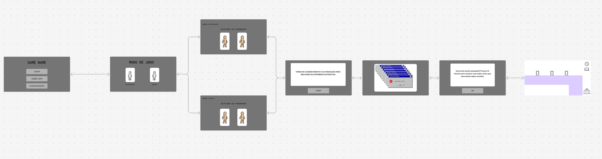
Figura 1: Rascunho de fluxograma desenvolvido no figma para idealizar a dinâmica de telas iniciais do jogo. Para melhor resolução da figura 1, acessar o link: https://www.figma.com/board/pugVsOrFEiULj4Ye3QjUSQ/GAME-UI?node-id=0-1&p=f&t=Dvd7yZTHT7PNVeQi-0
##

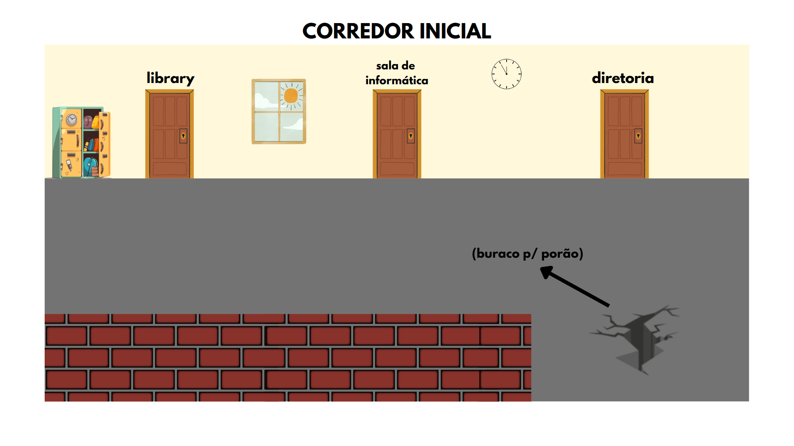
Figura 2: Esboço da idealização do cenário inicial do jogo, que apresenta o corredor onde o jogador irá iniciar sua missão
##

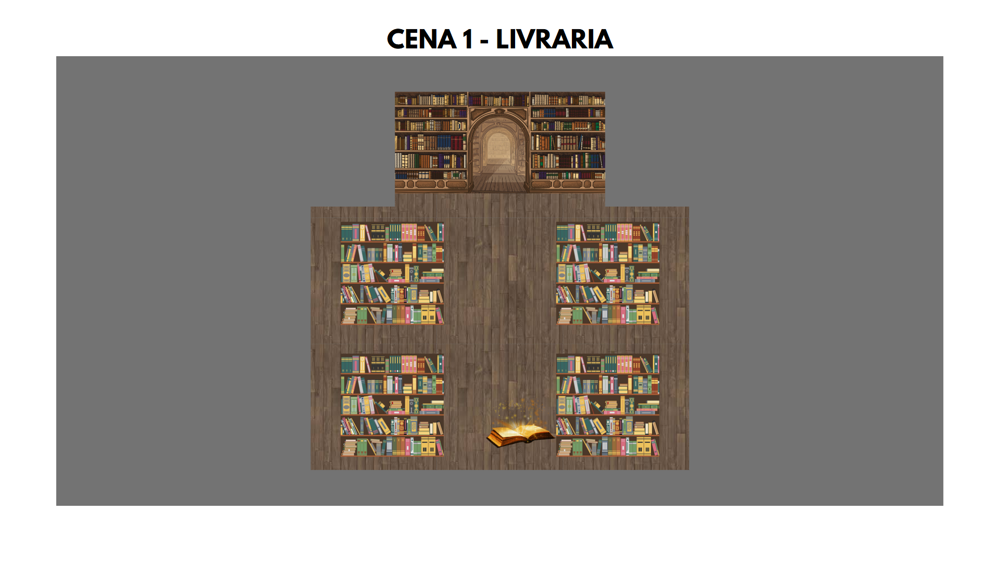
Figura 3: Esboço da idealização do segundo cenário do jogo, a biblioteca, onde o jogador terá seu primeiro contato com o tópico abordado no game, caracterizado pelas prateleiras e o livro, o qual desempenha um papel importante no enredo.
##

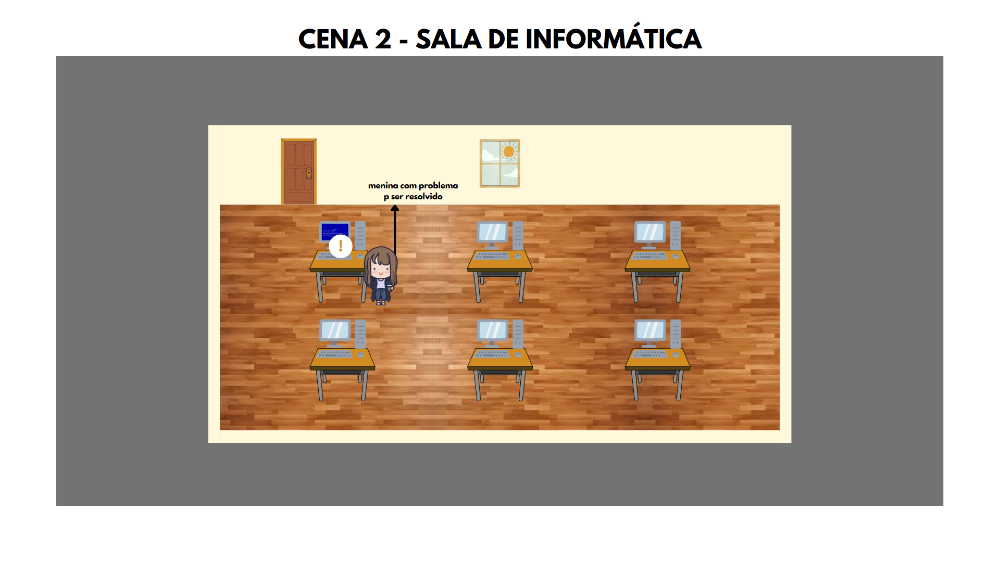
Figura 4: Esboço da idealização do terceiro cenário do jogo, o qual consiste em uma sala de informática, onde o jogador irá se deparar com o primeiro problema a ser solucionado, iniciando o desenvolvimento de seu conhecimento.

Para melhor resolução das imagens 2, 3 e 4, acessar o link: https://www.canva.com/design/DAGfevxOCDQ/Fd4aK0444zqJwiLHYFhOUw/edit?ui=eyJIIjp7IkEiOnRydWV9fQ
##

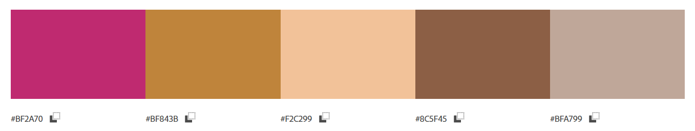
Figura 5: Paleta de cores provisória utilizada para desenvolvimento preliminar da estética do jogo.
##

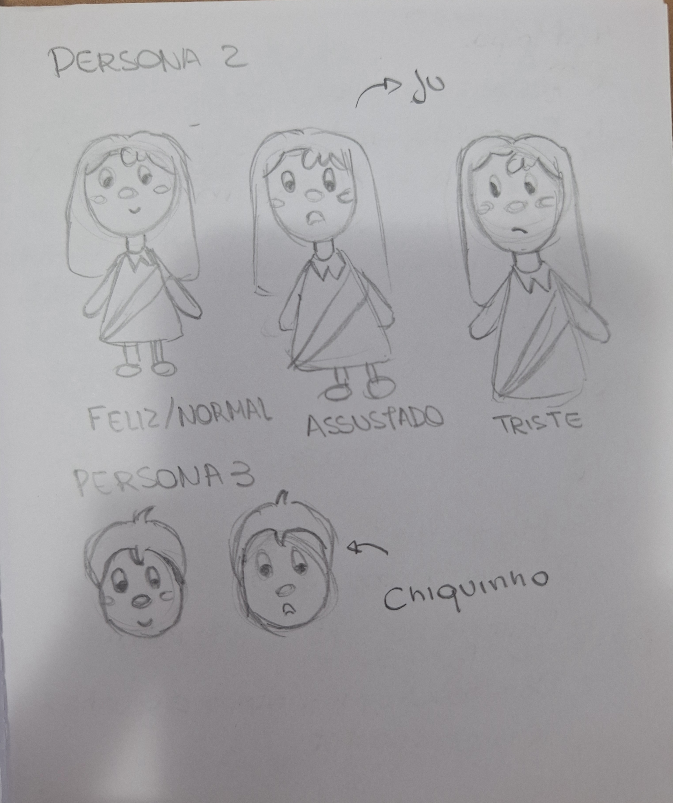
Figura 6: Concept art dos personagens jogáveis que os alunos poderão escolher.
##

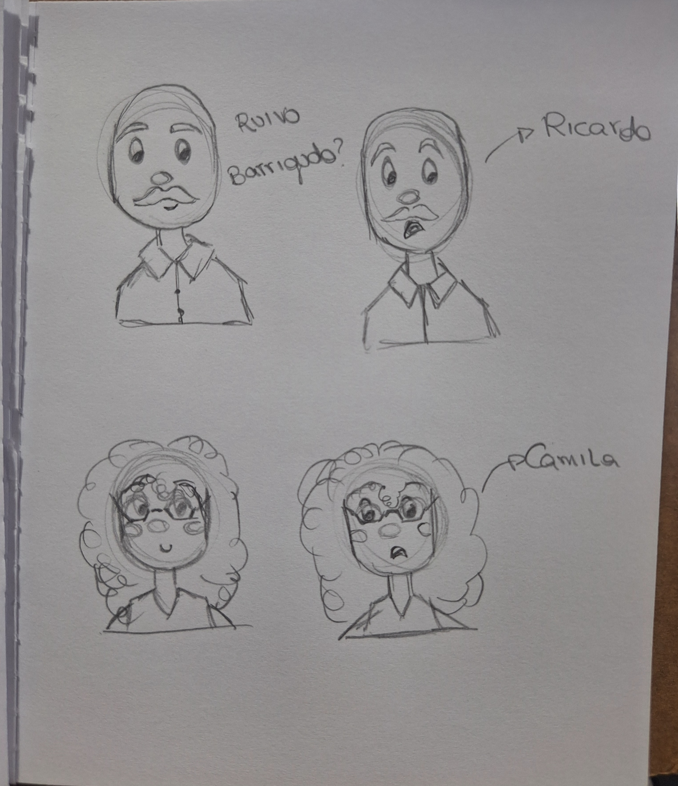
Figura 7: Concept art dos personagens jogáveis que os professores poderão escolher.
##

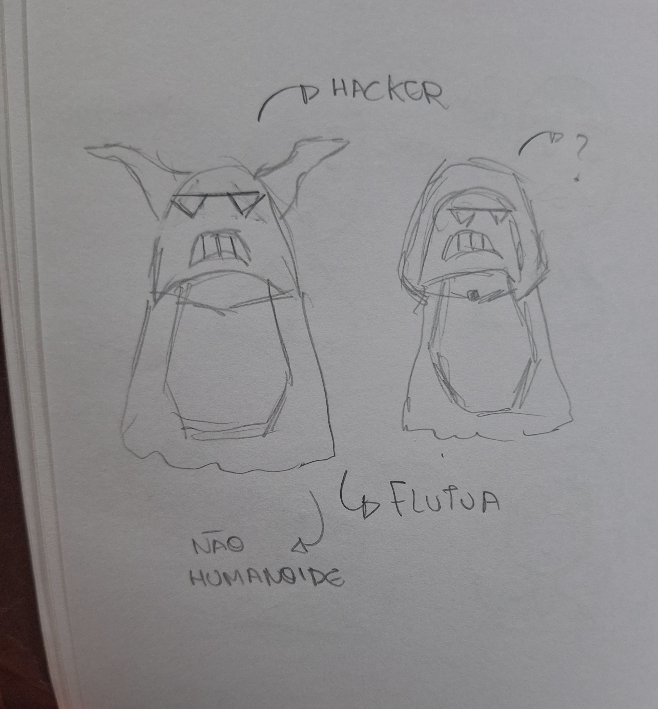
Figura 8: Concept art do vilão/ antagonista.

As figuras de 1 a 8 são autorais, desenvolvidas no Canva, Figma e papel a mão.

### 3.3.5. Trilha sonora (sprint 3)

*Descreva a trilha sonora do jogo, indicando quais músicas serão utilizadas no mundo e nas fases. Utilize listas ou tabelas para organizar esta seção. Caso utilize material de terceiros em licença Creative Commons, não deixe de citar os autores/fontes.*

*Exemplo de tabela*
\# | titulo | ocorrência | autoria
--- | --- | --- | ---
1 | tema de abertura | tela de início | própria
2 | tema de combate | cena de combate com inimigos comuns | Hans Zimmer
3 | ... 

## 3.4. Inventário e Bestiário (sprint 3)

### 3.4.1. Inventário

*\<opcional\> Caso seu jogo utilize itens ou poderes para os personagens obterem, descreva-os aqui, indicando títulos, imagens, meios de obtenção e funções no jogo. Utilize listas ou tabelas para organizar esta seção. Caso utilize material de terceiros em licença Creative Commons, não deixe de citar os autores/fontes.* 

*Exemplo de tabela*
\# | item |  | como obter | função | efeito sonoro
--- | --- | --- | --- | --- | ---
1 | moeda |  | há muitas espalhadas em todas as fases | acumula dinheiro para comprar outros itens | som de moeda
2 | madeira |  | há muitas espalhadas em todas as fases | acumula madeira para construir casas | som de madeiras
3 | ... 

### 3.4.2. Bestiário

*\<opcional\> Caso seu jogo tenha inimigos, descreva-os aqui, indicando nomes, imagens, momentos de aparição, funções e impactos no jogo. Utilize listas ou tabelas para organizar esta seção. Caso utilize material de terceiros em licença Creative Commons, não deixe de citar os autores/fontes.* 

*Exemplo de tabela*
\# | inimigo |  | ocorrências | função | impacto | efeito sonoro
--- | --- | --- | --- | --- | --- | ---
1 | robô terrestre |  |  a partir da fase 1 | ataca o personagem vindo pelo chão em sua direção, com velocidade constante, atirando parafusos | se encostar no inimigo ou no parafuso arremessado, o personagem perde 1 ponto de vida | sons de tiros e engrenagens girando
2 | robô voador |  | a partir da fase 2 | ataca o personagem vindo pelo ar, fazendo movimento em 'V' quando se aproxima | se encostar, o personagem perde 3 pontos de vida | som de hélice
3 | ... 

## 3.5. Gameflow (Diagrama de cenas) (sprint 2)

Esta seção (3.5) apresenta o gameflow do jogo por meio de um diagrama de cenas, ilustrando a progressão da experiência do jogador. 

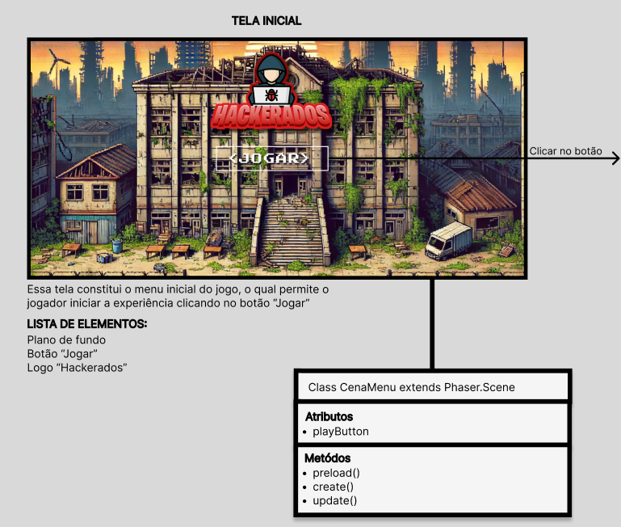
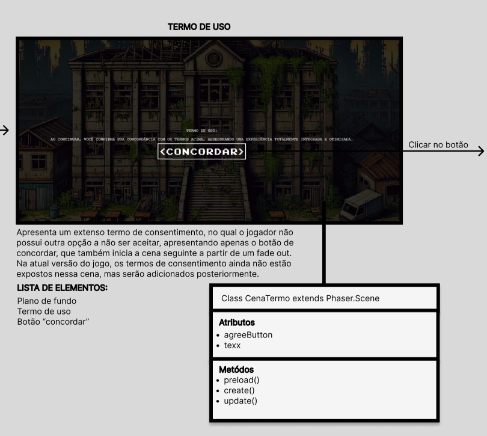
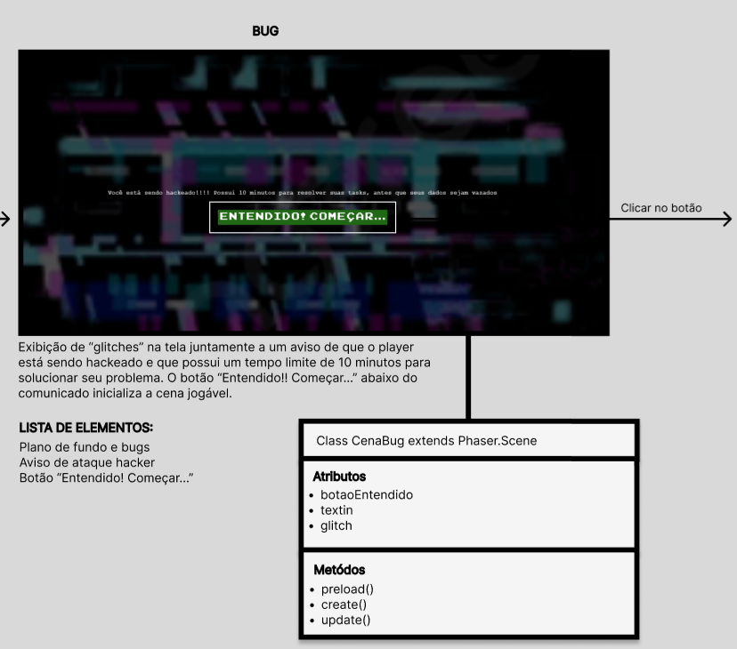
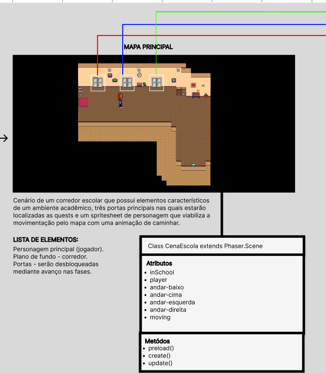
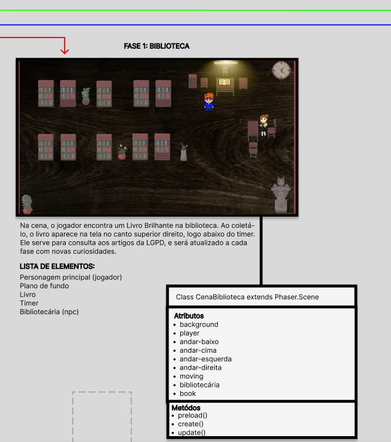
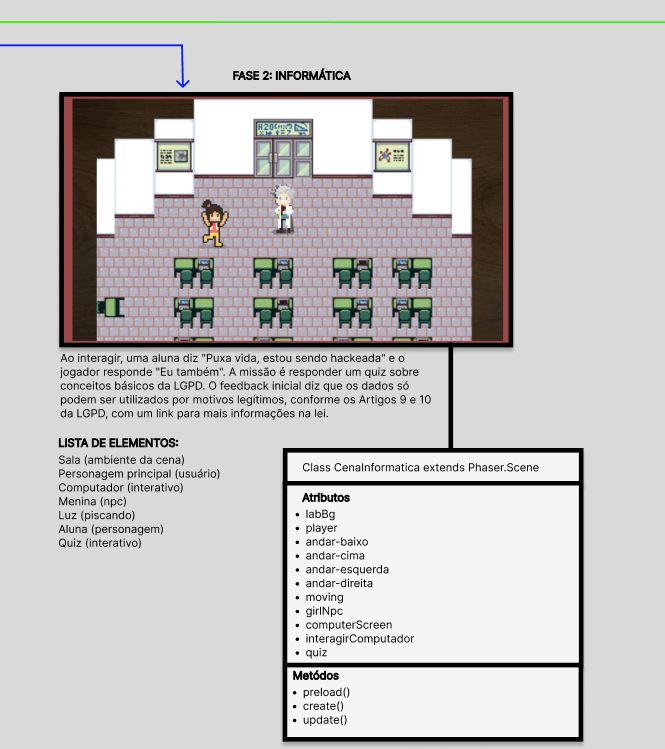
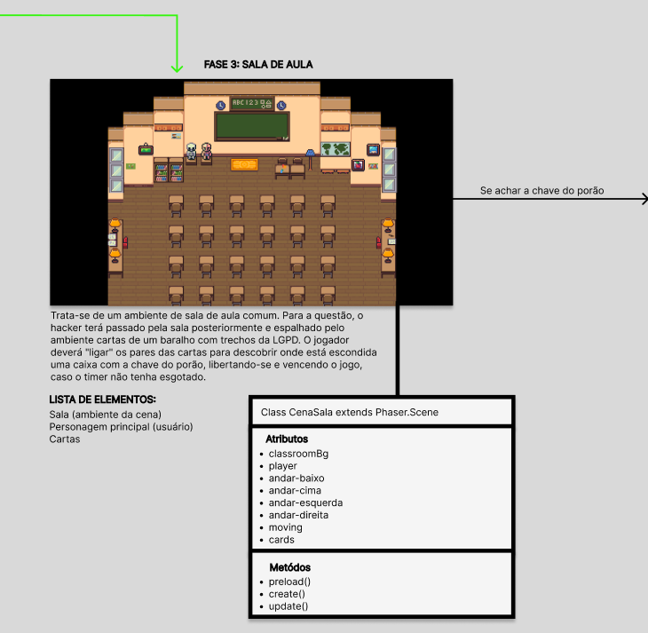
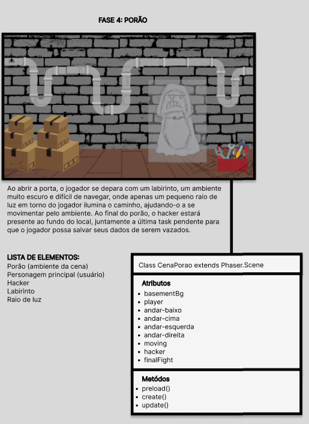

O Diagrama de Cenas também está disponível em: https://www.figma.com/design/UFVLbzHlNbqgeImhA0Jm21/GAMEFLOW---HACKERADOS?node-id=0-1&p=f&t=1Zmckgw01eTMz7VS-0


## 3.6. Regras do jogo (sprint 3)

*Descreva aqui as regras do seu jogo: objetivos/desafios, meios para se conseguir alcançar*

*Ex. O jogador deve pilotar o carro e conseguir terminar a corrida dentro de um minuto sem bater em nenhum obstáculo.*

*Ex. O jogador deve concluir a fase dentro do tempo, para obter uma estrela. Se além disso ele coletar todas as moedas, ganha mais uma estrela. E se além disso ele coletar os três medalhões espalhados, ganha mais uma estrela, totalizando três. Ao final do jogo, obtendo três estrelas em todas as fases, desbloqueia o mundo secreto.*  

## 3.7. Mecânicas do jogo (sprint 3)

*Descreva aqui as formas de controle e interação que o jogador tem sobre o jogo: quais os comandos disponíveis, quais combinações de comandos, e quais as ações consequentes desses comandos. Utilize listas ou tabelas para organizar esta seção.*

*Ex. Em um jogo de plataforma 2D para desktop, o jogador pode usar as teclas WASD para mecânicas de andar, mirar para cima, agachar, e as teclas JKL para atacar, correr, arremesar etc.*

*Ex. Em um jogo de puzzle para celular, o jogador pode tocar e arrastar sobre uma peça para movê-la sobre o tabuleiro, ou fazer um toque simples para rotacioná-la*

## 3.8. Implementação Matemática de Animação/Movimento (sprint 3)

*Descreva aqui a função que implementa a movimentação/animação de personagens ou elementos gráficos no seu jogo. Sua função deve se basear em alguma formulação matemática (e.g. fórmula de aceleração). A explicação do funcionamento desta função deve conter notação matemática formal de fórmulas/equações. Se necessário, crie subseções para sua descrição.*

# <a name="c4"></a>4. Desenvolvimento do Jogo
Durante a seção 4, será possível encontrar os detalhes e a descrição dos códigos do jogo, as telas condizentes a cada etapa do código e por fim, os detalhes do mínimo produto viável.

## 4.1. Desenvolvimento preliminar do jogo (sprint 1)

Nesta seção (4.1) serão apresentados os requisitos desenvolvidos durante a sprint 1 para entrega inicial do projeto.

Inicialmente, foram desenvolvidas quatro cenas executáveis, correspondentes às seguintes telas: o menu inicial, a tela de termos de consentimento, uma cena que exibe a invasão ao computador do jogador e define o tempo de jogo, além do cenário inicial.

A tela inicial apresenta a logo do projeto, Hackerados, acompanhada de um botão animado "Jogar", que, ao ser pressionado, aciona uma transição com efeito de fade-out, conduzindo à próxima cena. O plano de fundo dessa tela retrata uma escola destruída e danificada, elemento essencial para o desenvolvimento do enredo ao longo do jogo.

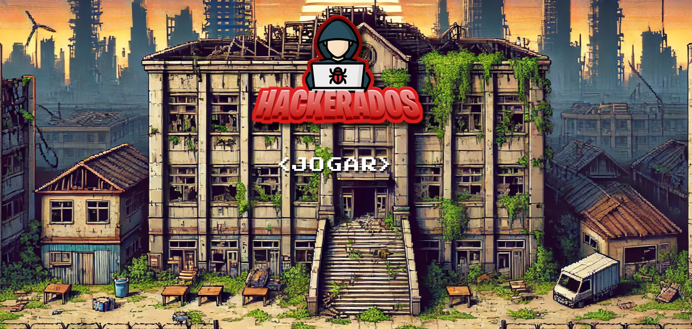
Fonte: Grupo HACKERADOS (Autoria Própria), 2025

Após a execução da função do botão "Jogar", a segunda cena exibe um termo de consentimento extenso, no qual o jogador não tem outra opção além de aceitá-lo. A tela apresenta apenas um botão de "Concordar", que, ao ser pressionado, aciona uma transição com efeito de fade-out, iniciando a cena seguinte.
Na versão atual do jogo, os termos de consentimento ainda não estão visíveis nessa cena, mas serão adicionados em futuras atualizações.

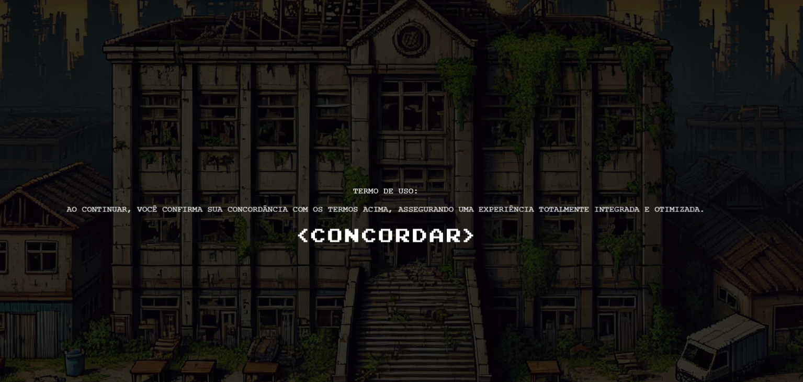 
Fonte: Grupo HACKERADOS (Autoria Própria), 2025

Em seguida, o panorama exposto tem como objetivo causar um senso de urgência no jogador por meio da exibição de “glitches” na tela, ideia efetivada por meio da utilização de spritesheets, juntamente a um aviso de que o player está sendo hackeado e que possui um tempo limite de 10 minutos para solucionar seu problema. O botão “Entendido!! Começar…” abaixo do comunicado (figura XX) inicializa a cena jogável.

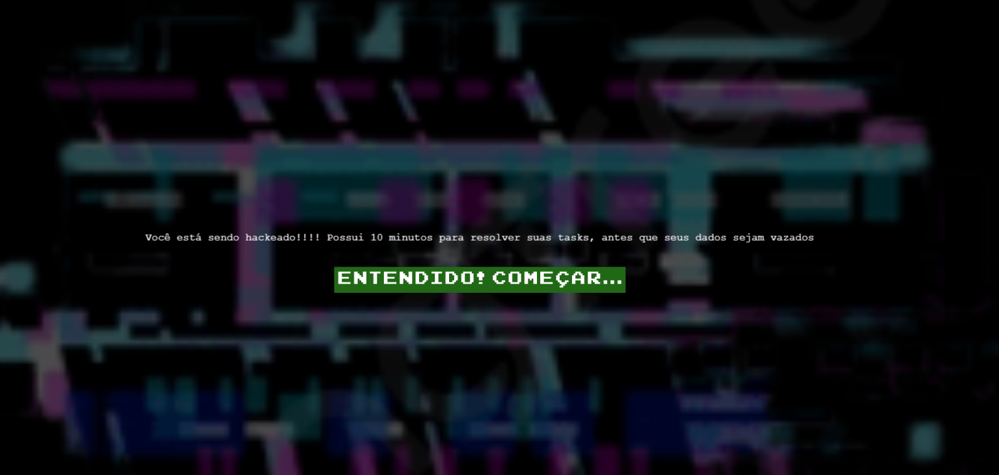 
Fonte: Grupo HACKERADOS (Autoria Própria), 2025

Então, a possibilidade de jogabilidade torna-se possível na cena 4, a qual contém um cenário de um corredor escolar que possui elementos característicos de um ambiente acadêmico, três portas principais nas quais estarão localizadas as quests e um spritesheet de personagem que viabiliza a movimentação pelo mapa com uma animação de caminhar. Nesta versão do jogo, o personagem ainda não possui características definidas, pois serão implementadas posteriormente.

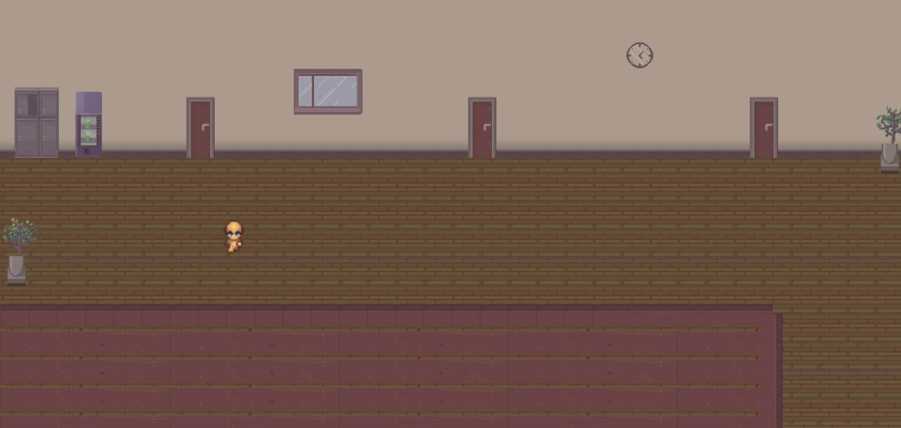 
Fonte: Grupo HACKERADOS (Autoria Própria), 2025

Em relação aos códigos empregados no desenvolvimento dessa versão do jogo, utilizamos os seguintes arquivos: “index.html”, “game.js”, “cena_menu.js”, “cena_termo.js”, “cena_bug.js”, “cena_escola.js” e uma pasta “assets” incluindo todas as figuras e recursos visuais.

No arquivo “game.js”, estabelecemos as configurações base do jogo, definindo o tamanho da tela, físicas e as cenas que estarão incluídas.

```
//Definir as configurações do jogo
const config = {
    type: Phaser.AUTO,
    width: 1535,
    height: 730 ,
    physics: { default: "arcade" },
    scene: [CenaMenu, CenaTermo, CenaBug, CenaEscola]
};

//Criar o jogo
const game = new Phaser.Game(config);

````

O arquivo “cena_menu.js” é iniciado pela declaração de uma classe que herda da classe Phaser.Scene, a qual mantém a estruturação básica de cenas no framework do Phaser, e define-se a chave da cena como “CenaMenu”. Todas as telas que serão apresentadas neste documento seguirão a mesma estrutura de criação de cenas.

```
// Criando classe para a cena
class CenaMenu extends Phaser.Scene {
    constructor() {
        super({ key: "CenaMenu" });
    }
//...

```
Utilizando o método preload(), são carregados os assets que serão utilizados.
```
//...
    preload(){
        this.load.image('bg', 'assets/menubgg.PNG');
        this.load.image('logo', 'assets/logoHackerados1.png')
        this.load.image('button', 'assets/playButton.png')
    }

//...
```

No método create(), são adicionados o fundo e a logo.

```
//...
    create() {
        // Adicionando fundo e logo
        this.add.image(767.5, 365, 'bg').setScale(1);
        this.add.image(750, 160, "logo").setScale(0.9);
    }
//...
```

Além disso, adiciona-se o botão “Jogar “ e, utilizando as funções “.setInteractive()” e “on(“pointerdown”)”, determinamos o que acontece ao clicar no botão. (fade out e troca de cena).
```
//...
        var botao = this.add.image(745, 365, "button").setScale(0.5)
            .setInteractive()
            .on("pointerdown", () => {
                this.cameras.main.fadeOut(1350)
                });

                this.cameras.main.once("camerafadeoutcomplete", () => {
                    this.scene.start("CenaTermo")}); 

//...
```
Em seguida, a animação de zoom in e out, a qual cria um efeito “bouncy” no texto, é incluída no botão, juntamente a uma diminuição de transparência quando passamos o mouse em cima.

```
//...
            // Animação de aumentar de tamanho
            this.tweens.add({
                targets: botao,
                scaleX: 0.55, 
                scaleY: 0.55,
                duration: 500, 
                yoyo: true, 
                repeat: -1, 
                ease: "Sine.easeInOut" 
            });

            // Diminuindo a transparência e tamanho quando o mouse está em cima do botão
            botao.on("pointerover", () => {
                botao.setScale(0.45);
                botao.setAlpha(0.7); 
            });
            
            botao.on("pointerout", () => {
                botao.setScale(0.5);
                botao.setAlpha(1);
            });
                       
    }
}
```

No arquivo “cena_termo.js”, é construída uma cena utilizando o mesmo método da anterior, são carregados os assets que serão utilizados por meio do método preload() e adicionados e posicionados a tela pelo método create(), além de incluir o fade in da cena.

```
// Criando classe para a cena
class CenaTermo extends Phaser.Scene {
    constructor() {
        super({ key: 'CenaTermo'});
    }

    preload() {
        this.load.image('bg', 'assets/menubgg.PNG');
        this.load.image('agreeButton', 'assets/agreeButton.png');

    };

    create() {
        // Animação de Fade In no início da cena
        this.cameras.main.fadeIn(500);
        
        // Adcionando fundo e diminuindo transparência
        const fundo = this.add.image(740, 365, 'bg').setScale(1.2)
        fundo.setAlpha(0.2);

        var texx = "AO CONTINUAR, VOCÊ CONFIRMA SUA CONCORDÂNCIA COM OS TERMOS ACIMA, ASSEGURANDO UMA EXPERIÊNCIA TOTALMENTE INTEGRADA E OTIMIZADA."

        // Adicionando textos 
        this.add.text(737.5, 365, 'TERMO DE USO:').setOrigin(0.5, 0.5)
        this.add.text(737.5, 400, texx).setOrigin(0.5, 0.5)
//...
```

Assim como no botão “Jogar”, o botão “Concordar” utiliza os mesmos métodos para se tornar interativo, trocar de cena e iniciar a animação de fade out.
```
//...
        // Adicionando botão e atribuindo a função de iniciar a animação de Fade Out e trocar de cena quando acabar
        var botaoConcordar = this.add.image(737.5, 450, "agreeButton")
            .setInteractive()
            .on("pointerdown", () => {
                this.cameras.main.fadeOut(2000)
                });

                this.cameras.main.once("camerafadeoutcomplete", () => {
                    this.scene.start("CenaBug")}); 
    };
}
```


Em “cena_bug.js”, a declaração de cena permanece a mesma e possui key “CenaBug”. São carregados no preload() o spritesheet de “glitch” que será utilizado no fundo e o botão de “Entendido!! Começar…”

```
// Criando classe para a cena
class CenaBug extends Phaser.Scene {
    constructor (){
        super({key: "CenaBug"})
    }

    preload() {
        this.load.spritesheet('glitch', "assets/glitch.png", {
            frameWidth: 300,
            frameHeight: 166
        });

        this.load.image("botaoEntendido", "assets/entendidoButton.png")
    }
//...
```

No método create() deste arquivo, estão incluídos o spritesheet do “bug” e as configurações de sua animação, para que seja possível reproduzi-la e atingir o resultado esperado, além da adição do texto que comunica o jogador da situação envolvendo o hack. Juntamente a isso, o botão também possui configurações de interatividade e clique para exercer a função de troca de cena e animação fade out, assim como mostrado nos botões anteriores.
```
    create() {
        
        // Adicionando sprite do bug do fundo e diminuindo e transparência
        this.bug = this.add.sprite(737.5, 270, "glitch").setScale(7);
        this.bug.setAlpha(0.3)

        // Criando animação de bug e reproduzindo
        this.anims.create({
            key: 'bugou',
            frames: this.anims.generateFrameNumbers('glitch', {start: 0, end: 20}),
            frameRate: 15,
            repeat: -1
        });

        this.bug.anims.play('bugou', true);

        var textin = 'Você está sendo hackeado!!!! Possui 10 minutos para resolver suas tasks, antes que seus dados sejam vazados'

        // Adicionando botão e atribuindo a função de iniciar a animação de Fade Out e trocar de cena quando acabar
        this.add.text(737.5, 365, textin).setOrigin(0.5)
        var botaozinho = this.add.image(737.5, 430, "botaoEntendido").setOrigin(0.5, 0.5)
            .setInteractive()
            .on("pointerdown", () => {
                this.cameras.main.fadeOut(1350)
            });

            this.cameras.main.once("camerafadeoutcomplete", () => {
                this.scene.start("CenaEscola");
            });
        botaozinho.setScale(0.75);
    };
}
```

Finalmente, o arquivo “cena_escola.js” cria a cena a partir da classe “CenaEscola” e,  utilizando preload() e create(), carrega e adiciona ao jogo a imagem do cenário principal e o spritesheet do personagem.
```
//Criando classe para a cena 
class CenaEscola extends Phaser.Scene {
    constructor() {
        super({ key: 'CenaEscola'});
    }

    preload(){
        this.load.image('inSchool', 'assets/mapaEscola.png');

        this.load.spritesheet("player", "assets/Unarmed_Walk/playerAnim.png", {
            frameWidth: 64,
            frameHeight: 64
        });
    }

    
    create() {
        // Animação de Fade In no início da cena
        this.cameras.main.fadeIn(500);
        
        // Adicionando o fundo e mudando a escala
        var background = this.add.image(767.5, 365, 'inSchool').setOrigin(0.5, 0.5);
        background.setScale(1.5)
        
        
        // Criando o jogador
        this.player = this.physics.add.sprite(400, 400, "player").setScale(2.7);
        this.player.setCollideWorldBounds(true);
//...
```

Ainda na função create(), criamos as animações do personagem e seus respectivos comandos para que sejam reproduzidas devidamente.
```
//...
// Criando animações
        this.anims.create({
            key: "andar-baixo",
            frames: this.anims.generateFrameNumbers("player", { start: 0, end: 5 }),
            frameRate: 10,
            repeat: -1
        });

        this.anims.create({
            key: "andar-esquerda",
            frames: this.anims.generateFrameNumbers("player", { start: 6, end: 11 }),
            frameRate: 10,
            repeat: -1
        });

        this.anims.create({
            key: "andar-direita",
            frames: this.anims.generateFrameNumbers("player", { start: 12, end: 17 }),
            frameRate: 10,
            repeat: -1
        });

        this.anims.create({
            key: "andar-cima",
            frames: this.anims.generateFrameNumbers("player", { start: 18, end: 23 }),
            frameRate: 10,
            repeat: -1
        });

        // Criando os controles
        this.cursor = this.input.keyboard.createCursorKeys();
        this.keys = this.input.keyboard.addKeys({
            W: Phaser.Input.Keyboard.KeyCodes.W,
            A: Phaser.Input.Keyboard.KeyCodes.A,
            S: Phaser.Input.Keyboard.KeyCodes.S,
            D: Phaser.Input.Keyboard.KeyCodes.D
        });
    }
//...
```

No método update(), associamos o ato de pressionar uma das teclas criadas a animação que deve reproduzir.
```
//...
update(){
            
        // Definindo o estado inicial do personagem
        let moving = false;
        this.player.setVelocity(0);

        // Adicionando os comandos que vão rodar quando cada tecla são pressionadas
        if (this.cursor.left.isDown || this.keys.A.isDown) {
            this.player.setVelocityX(-160);
            this.player.anims.play("andar-esquerda", true);
            moving = true;
        } 
        
        else if (this.cursor.right.isDown || this.keys.D.isDown) {
            this.player.setVelocityX(160);
            this.player.anims.play("andar-direita", true);
            moving = true;
        } 
    
        else if (this.cursor.up.isDown || this.keys.W.isDown) {
            this.player.setVelocityY(-160);
            this.player.anims.play("andar-cima", true);
            moving = true;
        } 
    
        else if (this.cursor.down.isDown || this.keys.S.isDown) {
            this.player.setVelocityY(160);
            this.player.anims.play("andar-baixo", true);
            moving = true;
        } 

        if (!moving) {
            this.player.anims.stop();
        }
    }
}
```


**Dificuldades durante o desenvolvimento:** 
Uma das principais dificuldades foi com certeza aprender uma nova linguagem de programação e, juntamente a isso, a incrementação e utilização de um framework (Phaser) que tornou o desenvolvimento do jogo desafiador. Na produção do jogo em si, a compreensão da mecânica de cenas foi um desafio, de modo a compreender cada parte do código e suas respectivas funções no funcionamento do projeto, bem como a adição de funcionalidade aos botões para executarem o que queríamos. A movimentação do personagem do zero em pixels, importando para linha de código, assim realizando a animação, além disso a limitação de áreas para quais o personagem pode ultrapassar ou não. Houve também a necessidade de aprender a utilizar softwares distintos para a parte visual do jogo, como Tiled e Pisqel, utilizados para desenvolver os mapas e personagens do jogo, além disso tivemos que desenvolver o lado tático para elaborar uma organização funcional dos códigos, para que fosse compreensível a todos e de fácil ajuste se necessário.

**Próximos passos:** 
Incluir público alvo, incluir diversidade e representatividade dos personagens,  elaborar 2 cenas integrando mapas e a mecânica do jogo com códigos comentados por grupo de funcionalidade.

## 4.2. Desenvolvimento básico do jogo (sprint 2)

Nesta seção (4.2) serão apresentados os requisitos desenvolvidos durante a sprint 2 para entrega básica do projeto.

Nessa sprint, poucas alterações foram realizadas nos códigos do jogo em si. Isso porque decidimos dar um enfoque especial à organização deste documento e, além disso, priorizamos entregar alterações significativas e caprichosas, a fim de entregar o melhor resultado possível, mesmo que pouco expressivo em relação a conteúdo, uma vez que parte da entrega requisitada já estava feita e entregue na sprint 1.

Assim, desenvolvemos os mapas das três primeiras fases do jogo, sendo elas biblioteca, laboratório de informática, sala de aula e, juntamente a isso, atualizamos o cenário do corredor principal. Ademais, foi inserido no jogo o spritesheet da primeira personagem jogável, a Ju, já com animação de caminhar funcionando.

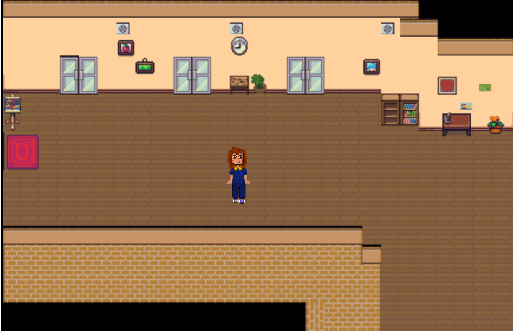 
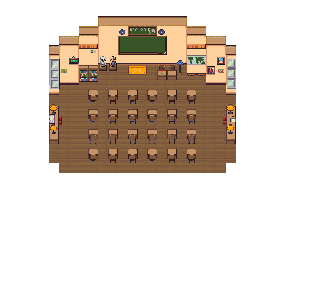 
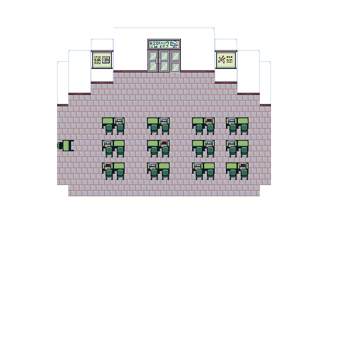 
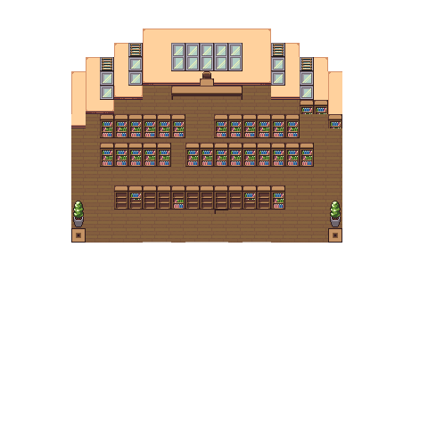 
Fonte: Grupo HACKERADOS (Autoria Própria), 2025

Em relação ao código do jogo, adicionamos salvaguardas nos botões que realizam a troca entre cenas, dado que, anteriormente, ao clicar várias vezes no botão, a transição de fade out era reproduzida também mais de uma vez. Tal medida foi realizada pela adição das seguintes linhas de código no momento em que os botões eram criados, as quais, por meio de uma condição if, que verifica se o botão está no estado “não clicado” e, se sim, torna a condição verdadeira e inicia a transição de fade out, juntamente com a troca de cena em linhas seguintes do código.

```
//...
        var botao = this.add.image(745, 365, "button").setScale(0.5)
            .setInteractive()
            .on("pointerdown", () => {
                if (!this.clicado) { // Impede múltiplos cliques
                    this.clicado = true; 
                    this.cameras.main.fadeOut(1350);
                }
            });
//...
```

Outrossim, alterações na adição dos spritesheet da personagem e do fundo também foram realizadas a partir do carregamento de um arquivo diferente, porém com o mesmo nome na variável da função de preload() do Phaser, a fim de evitar a substituição do nome no arquivo inteiro.
```
//...
    //Carregar imagem e sprite
    preload(){
        this.load.image('inSchool', 'assets/fundosJogo/mapaOficial.png');

        this.load.spritesheet("player", "assets/user_walk/Sprite_Lu.png", {
            frameWidth: 1805,
            frameHeight: 2394
        });
    }
//...
```
Os próximos passos estão alinhados aos valores que buscamos e, com isso, destacamos a inovação. Temos o objetivo de realizar detalhes em nossos personagens deixando com que haja uma familiarização maior com o jogador, podendo explorar opções de personalização ou até mesmo inclusão de novos personagens de escolha.
Para a programação identificamos a necessidade de um código mais fluído e com capacidade de colisão com o cenário, portanto adequar estas otimizações é essencial para o próximo passo em nosso desenvolvimento, além de, se possível, integrar mais cenas e minigames no projeto.


## 4.3. Desenvolvimento intermediário do jogo (sprint 3)

*Descreva e ilustre aqui o desenvolvimento da versão intermediária do jogo, explicando brevemente o que foi entregue em termos de código e jogo. Utilize prints de tela para ilustrar. Indique as eventuais dificuldades e próximos passos.*

## 4.4. Desenvolvimento final do MVP (sprint 4)

*Descreva e ilustre aqui o desenvolvimento da versão final do jogo, explicando brevemente o que foi entregue em termos de MVP. Utilize prints de tela para ilustrar. Indique as eventuais dificuldades e planos futuros.*

## 4.5. Revisão do MVP (sprint 5)

*Descreva e ilustre aqui o desenvolvimento dos refinamentos e revisões da versão final do jogo, explicando brevemente o que foi entregue em termos de MVP. Utilize prints de tela para ilustrar.*

# <a name="c5"></a>5. Testes

## 5.1. Casos de Teste (sprints 2 a 4)

Na seção 5.1. realizamos alguns testes para o controle do jogo Hackerados, descrevendo suas funcionalidades atuais existentes dentro do código.

*Exemplo de tabela*
\# | pré-condição | descrição do teste | pós-condição 
--- | --- | --- | --- 
1 | iniciar jogo | clicar no botão “jogar” | iniciar cena 2 (Termo de consentimento.)
2 | iniciar jogo | clicar no botão “concordar” | aviso de hackeamento de dados
3 | iniciar jogo |aguardar passagem da cena do aviso | surgimento do personagem no corredor principal
4 | inicialização de corredor | uso do KeyBoard para movimentação do personagem |movimentação no corredor principal
5 | movimento player | encontro com a primeira sala | transição de cena


## 5.2. Testes de jogabilidade (playtests) (sprint 4)

### 5.2.1 Registros de testes

*Descreva nesta seção as sessões de teste/entrevista com diferentes jogadores. Registre cada teste conforme o template a seguir.*

Nome | João Jonas (use nomes fictícios)
--- | ---
Já possuía experiência prévia com games? | sim, é um jogador casual
Conseguiu iniciar o jogo? | sim
Entendeu as regras e mecânicas do jogo? | entendeu as regras, mas sobre as mecânicas, apenas as essenciais, não explorou os comandos complexos
Conseguiu progredir no jogo? | sim, sem dificuldades  
Apresentou dificuldades? | Não, conseguiu jogar com facilidade e afirmou ser fácil
Que nota deu ao jogo? | 9.0
O que gostou no jogo? | Gostou  de como o jogo vai ficando mais difícil ao longo do tempo sem deixar de ser divertido
O que poderia melhorar no jogo? | A responsividade do personagem aos controles, disse que havia um pouco de atraso desde o momento do comando até a resposta do personagem

### 5.2.2 Melhorias

*Descreva nesta seção um plano de melhorias sobre o jogo, com base nos resultados dos testes de jogabilidade*

# <a name="c6"></a>6. Conclusões e trabalhos futuros (sprint 5)

*Escreva de que formas a solução do jogo atingiu os objetivos descritos na seção 1 deste documento. Indique pontos fortes e pontos a melhorar de maneira geral.*

*Relacione os pontos de melhorias evidenciados nos testes com plano de ações para serem implementadas no jogo. O grupo não precisa implementá-las, pode deixar registrado aqui o plano para futuros desenvolvimentos.*

*Relacione também quaisquer ideias que o grupo tenha para melhorias futuras*

# <a name="c7"></a>7. Referências (sprint 5)

MICROSOFT. Microsoft Teams for Education. Disponível em: <https://www.microsoft.com/en-us/education/products/teams>. Acesso em: 18 fev. 2025.

APPLE. Apple School Manager. Disponível em: <https://school.apple.com/>. Acesso em: 18 fev. 2025.

MOODLE. Moodle - Open-source learning platform. Disponível em: <https://moodle.org/>. Acesso em: 18 fev. 2025.

HOLONIQ. HolonIQ - Global Impact Intelligence. Disponível em: <https://www.holoniq.com/>. Acesso em: 21 fev. 2025.

GOOGLE CLOUD. Google Cloud. Disponível em: <https://cloud.google.com/>. Acesso em: 20 fev. 2025.

GOOGLE FOR EDUCATION. Chromebooks for Education. Disponível em: <https://edu.google.com/intl/ALL_br/chromebooks/>. Acesso em: 21 fev. 2025.

COUNTERPOINT RESEARCH. Counterpoint Research. Disponível em: <https://www.counterpointresearch.com/>. Acesso em: 20 fev. 2025.

GOOGLE FOR EDUCATION. Google for Education. Disponível em: <https://edu.google.com/intl/ALL_br/>. Acesso em: 21 fev. 2025.

CNBC. CNBC - Business News and Analysis. Disponível em: <https://www.cnbc.com/>. Acesso em: 20 fev. 2025.

PORTER, M. E. Competitive strategy: techniques for analyzing industries and competitors. New York: Free Press, 1980. Disponível em: <https://www.amazon.com.br/Competitive-Strategy-Techniques-Analyzing-Competitors/dp/0029253603>. Acesso em: 21 fev. 2025.

REUTERS. Reuters - Breaking News, Business & Market Headlines. Disponível em: https://www.reuters.com/. Acesso em: 20 fev. 2025.

SILVA, C. Principais gêneros de jogos e suas características. Disponível em: <https://gogamers.gg/gamepedia/principais-generos-de-jogos/>. Acesso em: 20 fev. 2025.

MMT_MOVPLAN. O que é e como usar o Google for Education: veja como aplicar. Disponível em: <https://movplan.com.br/blog/o-que-e-e-como-usar-o-google-for-education-veja-como-aplicar-na-instituicao/>. Acesso em: 20 fev. 2025.

LISBÔA, G. Tecnologias digitais na educação: como impactam o aprendizado. Disponível em: <https://www.ipnet.cloud/blog/gestao-empresarial/tecnologias-digitais-na-educacao/>. Acesso em: 25 fev. 2025.

IMED BOUCHRIKA. How Google Conquered the Classroom: The Googlification of Schools Worldwide in 2024. Disponível em: <https://research.com/education/how-google-conquered-the-classroom#2>.

GOOGLE FOR EDUCATION. Solutions built for teachers and students | google for education. Disponível em: <https://edu.google.com/>.  
‌
IMED BOUCHRIKA. How Google Conquered the Classroom: The Googlification of Schools Worldwide in 2024. Disponível em: <https://research.com/education/how-google-conquered-the-classroom#2>.
‌
LISBÔA, G. Tecnologias digitais na educação: como impactam o aprendizado. Disponível em: <https://www.ipnet.cloud/blog/gestao-empresarial/tecnologias-digitais-na-educacao/>.
‌
MIMS, C. Googling Is for Old People. That’s a Problem for Google. Disponível em: <https://www.wsj.com/tech/googling-is-for-old-people-thats-a-problem-for-google-5188a6ed>. Acesso em: 18 fev. 2025.

KHAN, N. Alphabet Fuels Waymo with $5.6 Billion Amid Broader AI and Tech Investments. Disponível em: <https://finance.yahoo.com/news/alphabet-fuels-waymo-5-6-164645478.html>. Acesso em: 18 fev. 2025.

Participação de mercado do mecanismo de pesquisa, tamanho e previsão, 2033. Disponível em: <https://www.businessresearchinsights.com/pt/market-reports/search-engine-market-101546>. Acesso em: 18 fev. 2025.

SABENDODEVENDAS. Bing x Google: comparação de mecanismos de pesquisa 2024 | SDV. Disponível em: <https://sabendodevendas.com.br/bing-x-google-comparacao-de-mecanismos-de-pesquisa-2024/>. Acesso em: 18 fev. 2025.

Google perdendo participação de mercado: uma visão geral de 2024 | Backlinks mundiais. Disponível em: <https://www.worldwidebacklinks.com/pt/seo/google-losing-market-share-a-2024-overview/>. Acesso em: 18 fev. 2025.

CYRAN, R. La solución de Google es distribución, tecnología y tiempo. Disponível em: <https://cincodias.elpais.com/opinion/2024-08-21/la-solucion-de-google-es-distribucion-tecnologia-y-tiempo.html>. Acesso em: 18 fev. 2025.

DISFOLD. Analisando o Modelo de Negócios do Google: O Que o Torna Lucrativo? - Disfold - Português. Disponível em: <https://pt.disfold.com/modelo-de-negocios-alphabet-google>. Acesso em: 18 fev. 2025.

PORTAL ÍNDICE. Qual o segmento da empresa Google? Disponível em: <https://www.portalindice.com.br/glossario/qual-o-segmento-da-empresa-google-entenda-aqui>. Acesso em: 18 fev. 2025.

ANDRÉ GIBIN; ANJOS, G. DOS; MELENDEZ, T. Para além da graduação: quais são as novas fronteiras do mercado de educação? Disponível em: <https://www.thinkwithgoogle.com/intl/pt-br/tendencias-de-consumo/tendencias-de-comportamento/educacao-mercado-crescimento-potencial/>. Acesso em: 18 fev. 2025.

DISFOLD. Google brand strategy. Disponível em: <https://blog.disfold.com/google-brand-strategy/?form=MG0AV3>. Acesso em: 27 fev. 2025.

BYNDER. Most valuable brands: Google’s secret to success. Disponível em: <https://www.bynder.com/en/blog/most-valuable-brands-google-secret-to-success/?form=MG0AV3>. Acesso em: 27 fev. 2025.

STATCOUNTER. Search engine market share. Disponível em: <https://gs.statcounter.com/search-engine-market-share?form=MG0AV3>. Acesso em: 27 fev. 2025.

ASANA. Análise SWOT: o que é e como fazer?. Disponível em: <https://asana.com/pt/resources/swot-analysis>. Acesso em: 27 fev. 2025.

TOTVS. Análise SWOT: conceito, importância e como fazer a sua. Disponível em: <https://www.totvs.com/blog/negocios/analise-swot/>. Acesso em: 27 fev. 2025.

SEBRAE. Conheça a análise SWOT. Disponível em: <https://sebrae.com.br/sites/PortalSebrae/conheca-a-analise-swot,202f64e8feb67810VgnVCM1000001b00320aRCRD>. Acesso em: 27 fev. 2025.

UNITAU. Material sobre análise SWOT. Disponível em: <https://unitau.br/files/arquivos/category_154/MCH0396_1427385441.pdf>. Acesso em: 27 fev. 2025.

FOLHA DOS LAGOS. Análise SWOT. Disponível em: <https://www.folhadoslagos.com/colunistas/post/analise-swot/1539/>. Acesso em: 27 fev. 2025.

GOOGLE. Grow with Google: courses and tools. Disponível em: <https://grow.google/intl/uk/courses-and-tools/>. Acesso em: 27 fev. 2025.

EDUCATE-ME. Google Classroom alternatives. Disponível em: <https://www.educate-me.co/blog/google-classroom-alternatives>. Acesso em: 27 fev. 2025.

TIC Kids Online Brasil 2023: Crianças estão se conectando à Internet mais cedo no país. (n.d.). Cetic.br - Centro Regional Para O Desenvolvimento Da Sociedade Da Informação. Disponível em: <https://www.cetic.br/pt/noticia/tic-kids-online-brasil-2023-criancas-estao-se-conectando-a-internet-mais-cedo-no-pais/>. Acesso em: 20 fev. 2025.

Falta de acesso à internet de qualidade impacta educação, trabalho e inclusão social nas periferias. Disponível em:
<https://projetocolabora.com.br/ods4/falta-de-acesso-a-internet-de-qualidade-impacta-educacao-trabalho-e-inclusao-social-nas-periferias/?amp=1>. Acesso em: 17 fev. 2025.

LGPD está fora da realidade de 80% das empresas no Brasil, diz estudo. (n.d.). Febrabantech.febraban.org.br. Disponível em: <https://febrabantech.febraban.org.br/blog/lgpd-esta-fora-da-realidade-de-80-das-empresas-no-brasil-diz-estudo>. Acesso em: 20 fev. 2025.

Nalin, C. (2024, October 30). Oito em cada dez brasileiros que conhecem a LGPD acreditam que seus dados estão seguros, diz pesquisa. O Globo. Disponível em:<https://oglobo.globo.com/economia/tecnologia/noticia/2024/10/30/oito-em-cada-dez-brasileiros-que-conhecem-a-lgpd-acreditam-que-seus-dados-estao-seguros-diz-pesquisa.ghtml>. Acesso em: 22 fev. 2025.

TIC KIDS ONLINE BRASIL 2022 Principais resultados. (n.d.). Disponível em: <https://cetic.br/media/analises/tic_kids_online_brasil_2022_principais_resultados.pdf>. Acesso em: 23 fev. 2025.


# <a name="c8"></a>Anexos

*Inclua aqui quaisquer complementos para seu projeto, como diagramas, imagens, tabelas etc. Organize em sub-tópicos utilizando headings menores (use ## ou ### para isso)*
